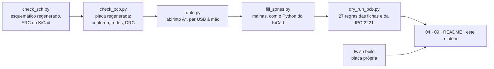

# Dry-run de 2026-09-26: placa, esquemático, mecânica e contas

O terceiro dry-run do projeto, e o primeiro que olhou as quatro coisas de
uma vez: a placa roteada, o esquemático, a mecânica da caixa e as contas
que sustentam os dois. Foi feito em três análises independentes (placa e
roteamento; esquemático; cálculos e mecânica), cada uma com o arquivo na
mão e as fichas dos fabricantes, e depois a cadeia do CAD rodou de novo com
o que saiu delas. Este documento diz o que foi medido, o que foi corrigido
no mesmo dia, o que continua errado e o que só o dono decide.

**Nesta página:** [O que foi medido](#o-que-foi-medido-e-como) · [Placa e roteamento](#placa-e-roteamento) · [Esquemático](#esquemático) · [Mecânica](#mecânica-a-caixa-e-a-placa) · [Contas](#contas) · [O que mudou hoje](#o-que-mudou-hoje) · [O que fica](#o-que-fica) · [Verificação](#verificação)

> [!WARNING]
> **Nada foi fabricado, montado nem medido.** Todo número abaixo sai de um
> arquivo de CAD, de uma ficha ou de uma conta feita aqui, e diz de qual.
> Dois erros meus do próprio dia estão registrados onde aconteceram: a
> conta do consumo do receptor a 3,0 V (dei 21 mA e 63 mW; a ficha dá
> 19 mA e 57 mW) e o `podar_soltas` que apagou vias de costura legítimas
> antes de aprender a ver uma junção em T.

## O que foi medido, e como

| Etapa | Resultado de 2026-09-26 |
|---|---|
| Esquemático | 6 folhas, 162 posições em `parts.py`, 124 nós, 114 elétricos; **o ERC do KiCad não acusa erro novo** (4 aceitos, um a um, com o motivo) |
| Placa gerada | 155 peças, 114 redes, 2 áreas de regra, 2 furos M2; **0 erros de DRC** antes do roteamento; nenhuma peça fora da borda, sobre outra ou em área de antena |
| Roteamento | 1.506 segmentos, 544 vias, **204 ligações fechadas, 59 sem trilha** em 26 redes; `RF_IN`, `RF_ANT`, `RF_CHIP` e `RF_UFL` de fora de propósito |
| Regras das fichas | **18 cumpridas, 5 violadas, 4 sem medida** ([09](09-dry-run-da-pcb.md#resultado-da-posição)) |
| DRC completo, malhas preenchidas | **44 itens desconectados em 30 redes**; **4 violações de isolamento** de 0,125 contra 0,127 mm (2 µm) entre `PWR_SCL` e `VBAT` junto do nPM1300; 20 avisos de biblioteca |
| Firmware da placa própria | build com **0 avisos de compilador**, FLASH 636.376 B, RAM 393.120 B, depois do devicetree acompanhar o receptor a 3,0 V |

A ordem e o intérprete importam, e errar qualquer um dos dois dá um resultado
que parece válido: o `check_pcb.py` regera a placa (nunca depois do
`route.py`), e o `fill_zones.py` só roda com `D:/KiCAD/bin/python.exe` —
com o Python do sistema ele avisa, sai, e o DRC conta centenas de pads de
terra "soltos" que não existem. Aconteceu duas vezes hoje antes de virar
armadilha registrada no `CLAUDE.md`.

## Placa e roteamento

O que a análise da placa achou, e o que foi feito com cada item:

| Achado | Gravidade | Situação |
|---|---|---|
| **Os documentos diziam "0 ligações sem trilha" com 47 e 55 em aberto.** O DRC rodava com `--severity-error`, que esconde os não roteados porque para o KiCad eles são aviso | grave (honestidade) | **corrigido**: a regra `RT1` roda o DRC com `--severity-all` e conta; `check_pcb.py` diz que não julga isso; 09 e os READMEs retificados |
| **O par USB nunca roteava.** Duas causas: a reserva de cada ilha arredondava para fora nos dois sentidos e fechava toda fileira de 0,5 mm de passo (`Grade._ret`); e nenhuma busca em labirinto tira um par de classe USB de duas fileiras de 0,5 mm em série | grave | **corrigido**: reserva pelo centro da célula; o trecho receptáculo → diodo → saída desenhado à mão (`ligar_usb()`), a 0,150 nos pescoços e 0,207 no resto; `US1` cumprida |
| A terceira tecla não cabia (a 3,56 mm da área da antena do módulo, que pede 5) | média | **corrigido**: passo 8,5 (4,5 · 13,0 · 21,5) |
| A reserva do furo M2 (1,7 mm) era menor que o courtyard do footprint (2,45): o Tag-Connect a 2,0 mm do furo, DRC de sobreposição | média | **corrigido**: reserva = courtyard + folga; o diodo do USB subiu 0,3 mm |
| `check_pcb.py` acusava o USB-C de passar da borda (centrava um courtyard que não é centrado) e cobrava um furo só | baixa | **corrigido** |
| O roteador e o verificador tomavam os números das redes do `nets.py` em vez do arquivo; uma rede acrescentada no meio de uma cadeia deslocou o `GND` em um | média | **corrigido**: `fp_load.redes_da_placa` |
| `AL2`: 3 segmentos do `VBAT_SYS` a 0,40 mm onde a IPC-2221 pede 0,57 | baixa | **em aberto**: largura por rede no `route.py` |
| `AL1`: `C117` a 6,7 mm do `U103` (limite 5) e `C114` a 2,3 do `U104` (limite 2) | baixa | **em aberto**: o colocador não achou lugar mais perto; à mão |
| 4 violações de isolamento de 2 µm entre `PWR_SCL` e `VBAT` | baixa | **em aberto**: um passo de grade à mão |
| 59 ligações sem trilha | — | **em aberto**: o roteador é A\* sem *rip-up*; o caminho é terminar no KiCad ou pelo FreeRouting ([09](09-dry-run-da-pcb.md#por-que-metade-e-o-que-fazer-com-a-outra-metade)) |
| A linha de 50 Ω calculada com Hammerstad (0,196 mm) ignora a espessura do cobre: com ela a linha fica em 44 a 46 Ω | média | **registrado** em 09; a largura final é do empilhamento do fabricante |

## Esquemático

| Achado | Gravidade | Situação |
|---|---|---|
| **Os divisores do `TERM` e do `SETSD` do ADP5091 pendiam do `BAT`, com o pino `REF` aberto.** A figura 42 da ficha (Rev. A, p. 19) pendura os quatro divisores externos no `REF`, que o CI liga ao `BAT` por chaves, com o resistor de histerese em série, e ao `TERM_REF` na comparação do fim de carga. Do jeito que estava, a equação 6 (fim de carga em 3,97 V) não valia e a histerese do `SETSD` não existia | **grave** | **corrigido**: nó `ADP_REF`; valores mantidos ([03](03-netlist.md#nós-sem-ligação-ao-mcu)) |
| **A pinagem do conector da célula em cobre não era a de [06](06-conectores-e-pontos-de-teste.md#j102--bateria)**: 1 `VBAT+`, 4 NTC e 6 `GND`, com 2, 3 e 5 soltos; um cabo feito como o documento manda punha o positivo no `GND` | **grave** | **corrigido**: 1 e 6 `VBAT+`, 2 e 5 `GND`, 3 `NTC_BAT`, 4 reservada |
| O divisor do NTC estava na placa **sem ninguém para lê-lo**: o ADP5091 não tem entrada de temperatura | grave | **corrigido** (decisão do dono): comparador TLV7031 alimentado pelo painel, saída em OU de diodos no `DIS_SW`. **Só o lado quente**: a carga abaixo de 0 °C ficou em aberto |
| A tecla central ligada ao `SHPHLD` (até 5,5 V) e ao P1.27 ao mesmo tempo | grave | **corrigido** (decisão do dono): Schottky `D107` isolando o pino |
| O receptor GNSS a 1,8 V pelo BUCK1, de ±5 %, onde a tabela 35 do manual pede ±2 % | média | **corrigido** (decisão do dono): receptor a **3,0 V** no trilho do MCU, sem tradutor; o LDO de ±1 % que existiu por umas horas custava 35 mW na bateria contra 11 da opção escolhida ([02](02-calculos.md#o-receptor-no-3v0-e-o-1v8-sem-carga)) |
| `REF`, `SETPG`, `SETHYST`, `LLD`, `BACK_UP` e `PGOOD` do ADP5091 sem nó e sem justificativa | média | `REF` **corrigido**; `SETBK` ao `AGND` como a tabela 5 manda; os outros quatro são saídas sem consumidor e ajustes do `PGOOD` — **conferir na ficha se `SETPG`/`SETHYST` abertos são aceitos** |
| `R111`, pull-up de um `IRQ` que o ADP5091 não tem, numa rede de um pino só | baixa | **corrigido**: saiu |
| `TXU0204` e o LDO de 1,8 V, com quatro capacitores | — | **saíram** com o receptor a 3,0 V |
| `FB301` com 230 mΩ onde o manual permite 0,2 Ω em série no `VCC`; `D105` de proteção do `SRC` | baixa | **corrigidos** (BLM18KG601SN1D de 150 mΩ; PESD3V3S1UB) |
| A pinagem do TLV7031 não confirmada na SNOSD54 (entrou hoje) | média | **em aberto**, marcado como não confirmado em `parts.py` |
| O `L103` de 22 µH do ADP5091 sem peça escolhida | média | **em aberto** |
| Os documentos 02, 04, 13, 14, 15 e 19 ainda dimensionam o **AEM10900**, que saiu do CAD em 2026-09-25 sem linha no CHANGELOG | média | 01, 03, 05, 06 e 07 **acertados hoje**; os outros seis **em aberto**, e o motivo da troca precisa ser registrado por quem a fez |
| O devicetree e o serviço de energia do firmware ainda falam AEM10900 e I²C `bias-pull-up` | média | **em aberto** ([10](../docs/10-status-do-port.md#defeitos-abertos)) |

## Mecânica: a caixa e a placa

Este é o achado que ninguém tinha visto, e o mais grave do dia:

> [!CAUTION]
> **A caixa desenhada (de manhã) era a da placa antiga, de 55 × 97 mm.** O
> desenho do conceito (`tools/docs/case_drawing.py`, retirado à tarde, quando
> a proposta medida de [`caixa/`](caixa/) o substituiu) e a seção "As duas sombras" de
> [04](04-pcb-e-caixa.md#as-duas-sombras-display-e-bateria) traziam
> retângulos de 47 mm de largura para uma placa de 34, e nenhum arquivo dizia
> onde o display e a célula caem sobre a placa de 34 × 90. A regra `ME2`
> passava **sem medir peça nenhuma**, e a análise mecânica apontou o que a
> regra deveria ter apontado: conector USB-C que não alcança a parede da
> caixa antiga, furo a 10 mm do lugar, peças de 4,29, 3,0 e 1,96 mm sob um
> teto de 1,2, e pilha de 19,9 mm numa caixa de 19 — **estes últimos números
> são da análise, não foram conferidos aqui**, porque a caixa certa ainda não
> existe.

O que foi feito: as duas sombras existem como **proposta** em
`cad/make_dxf.py` — o display de 61,8 mm acabando em y = 64,5 (acima das
teclas) e começando em 2,7; a célula de 60 mm de 9,9 a 69,9, logo abaixo da
antena GNSS —, a regra mede, e o que ela mede está em
[04](04-pcb-e-caixa.md#as-duas-sombras-display-e-bateria):

| Medida | Resultado |
|---|---|
| Peças mais altas que o teto da sombra | **5**: `J102` (4,25 mm), `LS601` (3,00) e `U502` (1,86) sob a célula, teto de 1,2; `J103` (3,75) e **`U301`, o próprio receptor (2,70)** sob o display, teto de 2,6 |
| O display sobre a antena GNSS | cobre **7,2 mm** da área da antena (y de 2,7 a 9,88); a ficha da Unictron não diz o que um vidro com ITO faz ao ganho |
| A célula entre as duas antenas | há **58,1 mm** entre a antena GNSS e a área da antena do módulo; a célula tem **60**: entra 1,9 mm no canto que a ficha do ME54BS13 reserva |
| `RF9` | a sombra do display fica a **6,8 mm** da área da antena do módulo; a ficha pede 25. Numa placa de 90 mm com um display de 61,8, a regra é impossível de cumprir |
| Área com teto dos dois lados | **61 %** da placa; só 25 % está livre das duas sombras |

O que segue disso é decisão do dono, e a ordem importa:

1. **A célula**: uma de até 58 mm (36 × 58 ou menor), ou aceitar o canto na
   área da antena do módulo e medir o S21 na bancada.
2. **O teto sob o display**: o receptor tem 2,70 mm e não tem para onde ir
   (fica junto da antena, que fica sob o display). O afastamento do display
   à placa tem de ser pelo menos 2,7 mm mais a folga — é número da caixa,
   não da placa.
3. **A face de trás abaixo da célula** (y de 70 a 90): é o único lugar para
   `J102`, o buzzer e o barômetro com o respiro, e o `J103` do painel
   também cabe lá. É uma nova passagem de colocação, e o roteamento inteiro
   muda com ela.
4. **`RF9`**: registrar que a regra do ME54BS13 não se cumpre com display
   nesta placa, e medir a dessensibilização na bancada.

## Os corpos 3D, peça a peça

O dono viu no 3D o conector do painel com as pernas para a borda e
desconfiou dos passivos e dos CIs. As duas coisas foram medidas em vez de
olhadas, e viraram regra:

| Medida | Resultado |
|---|---|
| `ME5`, os rabichos de solda dos cinco conectores de borda | `J101`, `J102`, `J401` e `J402` saem do corpo pelo lado das ilhas; **`J103` saía pelo lado oposto, 3,3 mm além do centro do corpo**: o giro de 180° que eu tinha posto no STEP do JST ZH em 2026-09-25 era o erro. Sem giro e com o deslocamento resolvido por medida (2,25; −2,00), o corpo cai exatamente no F.Fab |
| `ME6`, o eixo de todos os corpos contra o F.Fab | **132 peças medidas, 128 certas na primeira medida**; os quatro **SOT-523** saíam deitados (1,60 × 0,66 sobre um F.Fab de 0,80 × 1,60), porque a cota em `footprints.PACOTE` estava no eixo da ficha e não no do footprint. Corrigido; nenhum passivo e nenhum CI além desses estava fora do eixo |
| Corpos duplicados | o `make_3d.py` desenhava o `.wrl` da biblioteca por cima do `.step` que o GLB já traz: 105 passivos com dois corpos no mesmo lugar. Só quem não tem `.step` instalado é desenhado daqui agora |

O que a regra **não** mede: a marca de pino 1 de um encapsulamento quadrado
(nPM1300, ADP5091, os LGA) contra a ilha 1, e a faixa de catodo de um diodo
contra a ilha do catodo — os dois dependem de cor ou de um chanfro no
modelo, e um teste que "responde o que eu quero" já custou um dia. Ficam
para a inspeção visual do dono nas vistas 3D, que foram redesenhadas.

## Contas

| Conta | Resultado | Onde |
|---|---|---|
| Receptor a 3,0 V | 19 mA em rastreio (57 mW) e 24 na aquisição, 100 mA de pico na partida; o `3V0` vai a 47 mA em regime e 123 no pico (61,5 % do BUCK2); o `VSYS` a cerca de 74 mA; **+11 mW** na bateria contra o arranjo de 1,8 V, autonomia sem sol de cerca de 115 h para cerca de **97 h** | [02](02-calculos.md#o-receptor-no-3v0-e-o-1v8-sem-carga) |
| Rampa do `V_IO` na partida | agora pelo BUCK2: 167, 333 e 1.667 µs/V para partidas de 0,5, 1 e 5 ms, dentro de 25 a 35.000 | [02](02-calculos.md#rampa-do-v_io-na-partida) |
| Limiar do corte térmico | NTC 10 kΩ B3380 = 4,90 kΩ a 45 °C; com `R106` de 4,87 kΩ o divisor cruza a metade do `SRC` exatamente aí; com dois NTC em paralelo, corta a 25,7 °C | [01](01-esquematico.md#folha-1--energia) |
| `DIS_SW` com o cabo | 5,5 × 180 ÷ 280 = 3,5 V; acima do 1 V de nível alto, abaixo dos 6,0 V de máximo absoluto | [03](03-netlist.md#nós-sem-ligação-ao-mcu) |
| Fim de carga e corte de descarga do ADP5091 | 3/2 × 1,011 × (1 + 4,32/2,67) = **3,97 V**; 1,011 × (1 + 6,65/3,32) = **3,04 V** — válidas agora que os divisores pendem do `REF` | [03](03-netlist.md#nós-sem-ligação-ao-mcu) |
| Parafusos | a conta do dia 25 usava o braço de alavanca errado (40,8 mm em vez dos 3,7 do furo ao ponto de inserção): dois M2 dão 74 N·mm contra 40 pedidos, **1,85×**, não os "20×" que este projeto chegou a escrever | [02](02-calculos.md#quantos-parafusos-a-placa-precisa) |
| Largura de trilha | IPC-2221B com k = 0,048 externo e 0,024 interno; 0,8 A pedem 0,57 mm fora e o dobro dentro; 3 segmentos do `VBAT_SYS` a 0,40 | [09](09-dry-run-da-pcb.md) |
| Linha de 50 Ω | 0,196 mm por Hammerstad sem a espessura do cobre; 44 a 46 Ω com ela: só o empilhamento do fabricante fecha | [09](09-dry-run-da-pcb.md#por-que-rf_in-rf_ant-rf_chip-e-rf_ufl-não-são-roteadas) |
| εr | **conferido**: `ER_FR4 = 4.3` em `route.py` (marcado como assumido) e `epsilon_r 4.5` nas três camadas dielétricas do `.kicad_pcb`; os dois são palpite, e as larguras de 50 e 90 Ω saem do primeiro | **por acertar** num valor só, o do fabricante |

## O que mudou hoje

Em ordem de gravidade, tudo verificado na cadeia do CAD, no ERC e no build;
nada em placa:

1. o receptor GNSS a 3,0 V, no trilho do MCU, sem tradutor de nível nem LDO
   (CAD, devicetree, 01, 02, 03, 05, 07, 13, 14, 15, 16, 19);
2. os divisores do ADP5091 pendurados no `REF`;
3. o corte térmico da carga solar por comparador, alimentado pelo painel;
4. a tecla central isolada por Schottky;
5. a pinagem do `J102` igual à de 06;
6. as sombras do display e da célula como proposta, a regra `ME2` medindo,
   e os cinco conflitos que ela achou;
7. o par USB à mão e o roteador destravado nas fileiras de 0,5 mm;
8. a regra `RT1` e os "0 desconectados" retificados em 09 e nos READMEs;
9. as teclas a 8,5 mm de passo, a reserva dos furos igual ao courtyard, o
   `check_pcb.py` sem falsos positivos, o roteador e o verificador lendo as
   redes do arquivo;
10. `FB301`, `D105` e `R111`; os documentos 01, 03, 05, 06 e 07 acertados
    ao ADP5091.

## O que fica

**Do dono:**

- [ ] a célula de até 58 mm, ou aceitar o canto na antena do módulo;
- [ ] o teto sob o display (≥ 2,7 mm mais folga), e a caixa nova para a
      placa de 34 × 90;
- [ ] a carga solar abaixo de 0 °C: segundo comparador ou o risco;
- [ ] o motivo registrado da troca AEM10900 → ADP5091, e o `L103`.

**Do CAD:**

- [ ] nova colocação da face de trás abaixo da célula (`J102`, buzzer,
      barômetro, `J103`), e o roteamento de novo;
- [ ] as 59 ligações sem trilha, as 4 de isolamento e os 3 segmentos do
      `VBAT_SYS`;
- [x] **o esquemático no padrão industrial**, pedido do dono em 2026-09-26:
      **feito no mesmo dia** — blocos funcionais em caixas tracejadas com
      título, passivo ao lado do pino, rótulos em vez de fios compridos, A3 e
      A4 ([01](01-esquematico.md#como-as-folhas-são-desenhadas)). Fica por
      afinar a densidade em volta dos pinos do nPM1300 e do ADP5091, onde os
      nomes dos símbolos de alimentação se encostam;
- [ ] εr num valor só.

**Das fichas e da bancada:**

- [ ] pinagem e faixas do TLV7031 (SNOSD54); `SETPG`/`SETHYST` abertos no
      ADP5091;
- [ ] o display sobre a antena GNSS e a 6,8 mm da antena do módulo: medir;
- [ ] o empilhamento do fabricante, para as larguras de 50 e 90 Ω;
- [ ] tudo o que [09](09-dry-run-da-pcb.md#o-que-não-foi-medido) já
      listava.

**Do firmware** ([10](../docs/10-status-do-port.md#defeitos-abertos)):

- [ ] o standby do receptor não corta trilho nenhum: só `UBX-RXM-PMREQ`;
- [ ] o devicetree e o serviço de energia ainda falam AEM10900;
- [ ] os 46 µA do receptor em standby no orçamento.

## Adendo da tarde: a caixa medida, e o que ela mudou na placa

O dono pediu, ainda em 2026-09-26, as chaves da placa exatamente sob as capas
da caixa, um dry run da caixa inteira, a porta do USB-C, o berço de uma antena
GNSS externa e a fixação dos painéis laterais conferida. O
[`caixa/dry_run_caixa.py`](caixa/dry_run_caixa.py) mede a mesma `Caixa` que
desenha o PDF, as vistas e os STL, com 13 regras; na primeira rodada
**seis falharam**, e cada uma mudou alguma coisa:

| Regra | O que mediu | O que mudou |
|---|---|---|
| `CX1`, `CX3` | `J103` (3,75) a 0,05 mm da tampa e sob o display; `U301` (2,7) sob o display com teto de 2,6 | `J103` foi para o **verso**, em pé na borda esquerda; o teto sob o display subiu para **3,0** (a placa desceu 0,4 na caixa) |
| `CX4` | os furos das capas (5,6) entravam 1,3 mm no vidro do display, que acabava 1,5 mm acima das chaves | o display subiu 1,6 mm na placa (`make_dxf.DISPLAY_Y1` = 62,9); cobre 8,8 mm da área da antena GNSS em vez de 7,2 |
| `CX6` | o entalhe do USB-C começava 0,2 mm acima da base do receptáculo | começa 0,3 abaixo da face da placa |
| `CX10`, `CX11` | o chanfro de 6,2 tem 8,8 mm de rampa e o módulo ocupa 8,4: o degrau da cobertura passava das duas pontas; a placa da tampa atravessava a rampa 2,7 mm; o bolso atravessava a tampa de 1,5 | chanfro de **7,5** (rampa de 10,6, paredes de 1,1 nas pontas, 0,5 atrás do bolso), face rebaixada com tira de ponta a ponta, fendas de fio, placa da tampa começando dentro do sólido do chanfro, face interna a 1,0 do vidro |
| `CX12` | o berço da antena externa entrava 1,6 mm na placa | a caixa cresceu para **62 × 106** |
| `CX5` | 1,0 mm de vidro em volta da janela nos lados curtos | é o que o display dá; a regra pede 1,0 |

Depois disso: **12 regras medidas e cumpridas, 0 violadas, 1 não medida**
(fios dos módulos, juntas, aperto das capas, parafusos auto-atarraxantes).

Na placa, as mudanças do dia trouxeram três regras novas ao vermelho e todas
saíram: `OP1` contava o barômetro do verso e os 0402 como vizinhos do sensor
de luz (a regra passou a olhar só a mesma face e só peças mais altas que o
sensor); `ME6` chamava o `J202` de girado com as faces do buzzer, que está no
verso debaixo dele (a leitura dos corpos passou a separar as faces também para
os `.wrl`); `ME5` não achava rabichos no `J102` novo (o STEP do
kicad-packages3D está em `cad/3d/real/`); e o modelo do `J103` no verso
caía 2,14 mm fora do `F.Fab`, com os rabichos para o lado oposto ao das
ilhas, porque o `kicad-cli` espelha as ilhas do verso e não o modelo — e a
`ME4`, que só olhava z > 0,95, media o sensor de luz e o diodo da frente por
cima dele. Exportações do GLB com valores de prova, lidas de volta, deram
o giro de 180° e o deslocamento (−2,25; 1,86) de
`footprints.MODELO_GIRADO_VERSO`, conferidos pelas três regras; a `ME4`
passou a olhar a face da peça. O furo M2 de baixo, que
foi para (14,4; 91,7), empurrou o `TP101` para o caminho do par USB — curto,
isolamento de 0,071 e ponte de máscara no DRC —, e o par ganhou um corredor
reservado no colocador. O colocador, por sua vez, entrava em laço sem fim
quando uma peça não cabia (a mesma onda voltava a cada volta): hoje desiste
dela e diz qual.

Depois da publicação, o dono viu no 3D o **`J402`** (o FPC do filme de luz,
HCTL) com o STEP **180° fora**. Medido por cor no GLB: os cinco contatos
dourados saíam do corpo pela esquerda, sobre nada, com as ilhas de sinal à
direita; a `ME5` e a `ME6` tinham deixado passar porque a chapa das unhas de
fixação, do lado das ilhas no modelo errado, pesa mais que cinco rabichos de
0,3 mm. O modelo é girado pela `footprints.MODELO_GIRADO` (180°, sem
deslocamento, medido), e as duas regras passaram a medir pela cor dos
contatos quando o modelo a tem (`CONTATOS_POR_COR`): o modelo errado dá
−0,26 mm, lado oposto; o certo, +0,26.

| Medida | Antes (manhã) | Depois (tarde) |
|---|---|---|
| Placa | 34 × 90 | **34 × 95**, teclas em x 3,6, 17 e 30,4 (passo 13,4) |
| Regras do `dry_run_pcb.py` | 24 cumpridas, 5 violadas, 4 não medidas | **25 cumpridas, 4 violadas** (`RF9`, `AL1`, `AL2`, `RT1`), 4 não medidas |
| DRC completo | 4 erros | **0 erros**, 20 avisos de biblioteca |
| Ligações | 204 roteadas, 59 sem trilha | 196 roteadas, 75 sem trilha; 58 itens desconectados em 37 redes (`RT1`) |
| Peças fora das sombras (`ME2`) | 5 dentro | **0**: `J102` (SH, frente), `J103` e `LS601` e `U502` (verso), `U301` (teto de 3,0) |
| Caixa | conceito de 62 × 104 × 19, sem medida | **62 × 106 × 17**, 12 regras cumpridas, 0 violadas |

Nada impresso, nada montado.

## Verificação

- `python hardware_gnssbike/cad/check_sch.py`: o esquemático confere com a
  lista de nós; o ERC não acusa erro novo; 16 peças com pinagem por confirmar
  na ficha.
- `python hardware_gnssbike/cad/check_pcb.py` (regera) → `route.py` →
  `"D:/KiCAD/bin/python.exe" fill_zones.py` → `check_pcb.py --como-esta` →
  `dry_run_pcb.py` → `make_3d.py` → `make_2d.py` → `montagem.py` →
  `caixa/dry_run_caixa.py` → `caixa/make_caixa.py`: os números deste documento (o adendo
  é a rodada da tarde).
- `BOARD=gnssbike/nrf54lm20a/cpuapp BUILD_DIR=zephyr_app/build_custom bash tools/fw/fw.sh build`:
  0 avisos de compilador.
- `python tools/docs/mermaid_check.py` e `python tools/docs/links_check.py`:
  rodados depois de fechar os documentos deste dia.
- Nada testado na placa, nem no DK, nem com componente nenhum.
