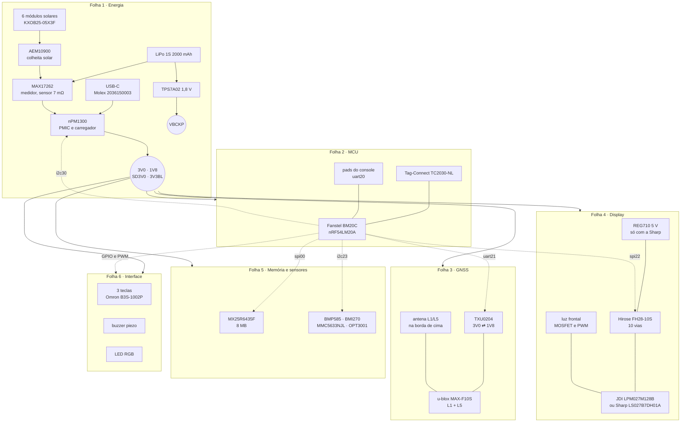

<div align="center">

# Esquemático · GNSS Bike Computer

**Placa `gnssbike`, nRF54LM20A no módulo Fanstel BM20C**


</div>

O esquemático completo do aparelho: cada folha, cada ligação e a conta que
justifica cada valor. Nasce da especificação de [`docs/14`](../docs/14-hardware-placa-nova.md),
da avaliação de [`docs/15`](../docs/15-avaliacao-componentes.md) e da lista
validada de [`docs/19`](../docs/19-lista-de-compras.md), e fecha o que
faltava: os nós com nome, os passivos com valor, e o mapa de pinos do
[devicetree](../zephyr_app/boards/gnss/gnssbike/) levado até o pino do
componente.

> [!WARNING]
> **Nada disto foi montado, medido ou fabricado.** Não existe placa, não
> existe layout e nenhum componente passou por bancada. Todo valor abaixo
> vem de datasheet ou de conta feita aqui, e está marcado como tal. O que
> depende de medida está na seção [O que só a bancada decide](#o-que-só-a-bancada-decide).

## Índice

| Documento | O que traz |
|---|---|
| [01 · Folhas do esquemático](01-esquematico.md) | as seis folhas, bloco a bloco, com todas as ligações |
| [02 · Cálculos](02-calculos.md) | cada valor de componente, com a conta e a origem |
| [03 · Lista de nós](03-netlist.md) | o esquemático como lista: nó, de onde sai, aonde chega |
| [04 · Placa e caixa](04-pcb-e-caixa.md) | tamanho, camadas, posicionamento, zonas proibidas |
| [05 · Materiais por folha](05-materiais.md) | o que cada folha consome, ligado à lista de compras |

## O aparelho em blocos



## Referências que este esquemático segue

Seguir a referência de projeto quer dizer coisas diferentes para cada
bloco, e vale dizer exatamente qual foi usada em cada caso:

| Bloco | Referência seguida | Onde foi conferida |
|---|---|---|
| Rádio de 2,4 GHz e alimentação do MCU | **módulo BM20C**: casamento, antena e cristais são do módulo, não deste projeto; o que sobra para a placa é o desacoplamento, a zona livre da antena e os pads de USB, SWD e console | ficha Fanstel Draft 0.99 (pinagem p. 11, montagem p. 17), conferida em [15](../docs/15-avaliacao-componentes.md#módulo-do-mcu) |
| Caminho de energia | **configuração 1 da lista de referência da Nordic** para o nPM1300 (tabelas 39 e 40 da ficha), com os indutores e capacitores que ela pede | ficha nPM1300 v1.1, conferida em [15](../docs/15-avaliacao-componentes.md#detalhes-para-o-esquemático) |
| Colheita solar | **lista mínima de materiais da e-peas** (tabela 43 da ficha do AEM10900), com a exceção registrada do indutor | ficha AEM1090x v2.4.0 |
| Medidor de bateria | **circuito de aplicação do MAX17262** com sensor entre BATT e SYS | ficha Maxim |
| GNSS | **projeto de referência do MAX-F10S**: entrada com SAW, LNA e SAW já dentro do módulo; a placa entrega alimentação limpa, a linha de 50 Ω e a zona livre | ficha MAX-F10S R03, conferida em [15](../docs/15-avaliacao-componentes.md#gnss) |
| Display | ficha do painel e do conector: ordem dos 10 pinos, EXTMODE no VDD, VCOM pelo EXTCOMIN | fichas JDI LPM027M128B Ver.01 e Sharp LS027B7DH01 (LD-28305A) |

> [!IMPORTANT]
> **O documento de diretrizes de projeto de hardware do nRF54LM20 da
> Nordic não foi lido nesta sessão.** O que protege o projeto disso é o
> módulo: a parte de radiofrequência, que é onde essas diretrizes mandam,
> vem pronta e certificada no BM20C, e o que a placa faz em volta dele
> segue a ficha do módulo. Se o dono quiser o chip direto na placa algum
> dia, essas diretrizes passam a ser obrigatórias e este esquemático não
> serve como está.

## O que só a bancada decide

| Em aberto | Por quê | Onde |
|---|---|---|
| Pad LGA de cada GPIO no BM20C | a ficha diz que o módulo expõe 64 GPIO, mas o de-para pino a pino não foi levantado aqui; o esquemático liga por nome de sinal, o layout precisa do pad | [01](01-esquematico.md#folha-2--mcu) |
| Indutor do AEM10900 | a tabela 6 e a fórmula da seção 6.7.2 da ficha não batem; 4,7 µH é a escolha, 6,8 µH é o valor das curvas publicadas | [02](02-calculos.md#colheita-solar) |
| Tolerância do cristal de 32,768 kHz do módulo | o ANT+ exige ±50 ppm e a ficha do BM20C não informa | [01](01-esquematico.md#folha-2--mcu) |
| Corrente real da luz do display | depende da tensão direta do LED da amostra | [02](02-calculos.md#luz-do-display) |
| Isolamento entre a antena do GNSS e a do rádio | os dois ficam na mesma placa de 55 × 97 mm | [04](04-pcb-e-caixa.md#zonas-proibidas) |
| Calor do carregador linear | de 0,48 a **1,50 W** na corrente constante, conforme a tensão do USB e a carga da célula; numa caixa vedada isso põe a junção perto de 73 °C no pior caso | [02](02-calculos.md#calor-do-carregador) |

## O dry-run de 2026-09-22

O esquemático foi escrito e depois **revisado contra si mesmo e contra as
fontes**, com duas passagens independentes: uma refez todas as contas e
procurou contradição interna, a outra conferiu folha por folha contra
[`docs/13`](../docs/13-placa-nova.md), [`14`](../docs/14-hardware-placa-nova.md),
[`15`](../docs/15-avaliacao-componentes.md), [`19`](../docs/19-lista-de-compras.md)
e o devicetree. Acharam **43 problemas**, sendo **6 graves**.

Vale dizer o que isso significa: quase todos os graves eram **erro de quem
escreveu o esquemático, não falha da especificação**. A especificação já
trazia o arranjo certo e o rascunho não a leu com cuidado suficiente.

| Grave | O que era | Como ficou |
|---|---|---|
| Direção dos canais do tradutor de nível | o rascunho pôs o `RX` num canal que vai do MCU ao receptor e o `RESET_N` num que vai do receptor ao MCU: **saída contra saída nos dois pares**, e o receptor nunca falaria com o MCU. Daí concluiu que "cinco sinais não cabem em quatro canais" e deixou o `EXTINT` sem componente | refeito: o `RESET_N` **não passa pelo tradutor** (dreno aberto, pull-up interno do módulo), e os quatro canais atendem `TX`, `EXTINT`, `RX` e `TIMEPULSE`, dois em cada sentido, como a [especificação](../docs/14-hardware-placa-nova.md#gnss) já dizia |
| Sensor do medidor de bateria | o rascunho criou um resistor externo de 7 mΩ e pinos `CSP`/`CSN` que o CI não tem. Montado assim, a resistência dobra e o medidor erra **toda** corrente | o sensor é **interno** à `MAX17262REWL+T`; a peça inventada saiu |
| `STO_CFG[1]` do AEM10900 | ausente de todos os arquivos. Pino de configuração aberto lê alto, e é ele que decide o limiar de carga da célula ao sol | ao `GND`, com os outros dois no `VINT`: H, L, H, carga até 3,90 V e corte em 3,01 V |
| `OE` do tradutor | não existia em nó nenhum; aberto, as saídas ficam indefinidas na partida | fixo no `VCCA` |
| `CSB` do BMP585 e do BMI270 | condição enunciada em prosa e sem nó: os dois nasceriam em SPI e o barramento não acharia ninguém | na tabela de [pinos de configuração](03-netlist.md#pinos-de-configuração-amarrados-em-cobre) |
| Acionamento do LED RGB | catodo direto no pino do MCU, com o anodo num trilho que chega a 5,5 V | um MOSFET por cor, com 1 kΩ, como a especificação já pedia |

### O que continua aberto depois do dry-run

Não foi resolvido aqui, e precisa de decisão ou de bancada:

| Em aberto | Por quê |
|---|---|
| **A tecla central está em dois lugares** e a especificação diz que não pode; resolver muda o firmware ([03](03-netlist.md#interface)) | decisão do dono |
| **A tela decidida (JDI B) não tem luz**; quem tem é o C, sem canal de compra ([01](01-esquematico.md#folha-4--display)) | decisão do dono |
| **A antena escolhida não cabe na zona reservada**: 10,75 mm contra 8 mm ([04](04-pcb-e-caixa.md#zonas-proibidas)) | decisão de mecânica |
| **Domínio de tensão dos pinos digitais do nPM1300** ([02](02-calculos.md#pull-ups-do-i²c)) | ler a ficha |
| **De que lado do sensor interno fica cada pino do MAX17262** ([01](01-esquematico.md#folha-1--energia)) | ler a ficha |
| Os seis módulos solares em série ou em paralelo, e diodo de bloqueio entre eles: quatro ficam em chanfros de 45°, de modo que **sombreamento parcial é o normal** | falta definir |
| Corrente de entrada no `VBUS`: carga mais sistema dão cerca de **670 mA**, e uma fonte USB-C comum oferece 500 mA | falta a conta fechada |
| Sem proteção nas três teclas, que são o que o ciclista toca | falta |
| Sem capacitor de volume junto do módulo, que é a carga de transitório mais rápido do `3V0` | falta |
| Sem ponto de teste nos trilhos, e o conector da bateria sem pinagem declarada | falta |

## Verificação

```sh
python tools/docs/mermaid_check.py     # diagramas
python tools/docs/links_check.py       # links e âncoras
python tools/fw/board_check.py         # o mapa de pinos do firmware
python hardware_gnssbike/net_check.py  # a lista de nós contra o devicetree
```

O `net_check.py` é deste esquemático: lê a [lista de nós](03-netlist.md) e
o devicetree da placa e confere **cinco coisas, todas no nível do pino do
MCU** — pino do firmware ausente do esquemático, pino do esquemático que o
firmware não usa, pino em dois nós, pino além do tamanho da porta e nome
de nó repetido.

> [!IMPORTANT]
> **Ele não confere o circuito.** Não vê dois acionadores no mesmo nó, não
> vê entrada flutuando, e não enxerga nada fora das tabelas com coluna
> "Pino do MCU" — de modo que `STO_CFG[1]`, `OE`, `CSB` e `EXTMODE` estão
> fora do alcance dele. Ele imprimiu "esquemático e devicetree batem" com
> três erros elétricos graves dentro, que só a revisão de 2026-09-22
> achou. Passar no `net_check.py` quer dizer que os pinos do MCU batem com
> o firmware, e nada mais.
