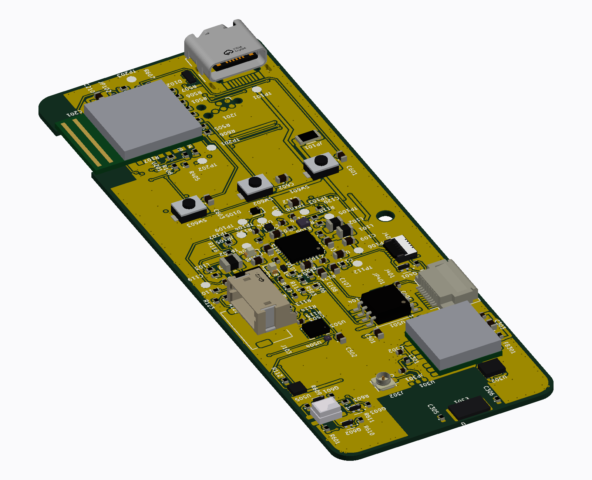
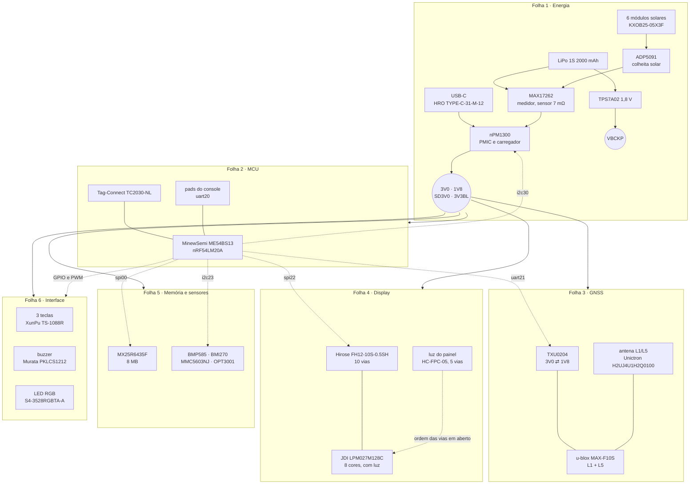

<div align="center">

# Hardware · GNSS Bike Computer

**Placa `gnssbike`, nRF54LM20A no módulo MinewSemi ME54BS13**


</div>



O hardware completo do aparelho: cada folha do esquemático, cada ligação, a
conta que justifica cada valor — e a placa, com as peças postas, o cobre
roteado e as vistas 2D e 3D. Nasce da especificação de
[`docs/14`](../docs/14-hardware-placa-nova.md), da avaliação de
[`docs/15`](../docs/15-avaliacao-componentes.md) e da lista validada de
[`docs/19`](../docs/19-lista-de-compras.md), e fecha o que faltava: os nós
com nome, os passivos com valor, e o mapa de pinos do
[devicetree](../zephyr_app/boards/gnss/gnssbike/) levado até o pino do
componente.

> [!WARNING]
> **Nada disto foi montado, medido ou fabricado.** A placa existe como
> arquivo de CAD — 144 peças, 112 redes, 915 segmentos, 430 vias, **0
> violações de regra de projeto e 0 ligações sem trilha** —, mas nenhuma foi
> feita e nenhum componente passou por bancada. Todo valor abaixo vem de
> ficha ou de conta feita aqui, e está marcado como tal. O que depende de
> decisão, de ficha por ler ou de medida está na lista de
> [Antes de mandar fabricar](#antes-de-mandar-fabricar).

## O CAD

Tudo em [`cad/`](cad/) é **gerado por programa**, não desenhado à mão: o
esquemático, o footprint de cada peça, a colocação, o roteamento e as
vistas. A cadeia inteira e os comandos estão em
[`cad/README.md`](cad/README.md).

| Arquivo | O que é |
|---|---|
| `gnssbike-esquematico.pdf` | as seis folhas, com símbolo de peça de verdade |
| `gnssbike-pcb.pdf` | sete páginas: uma por camada de cobre, mais a de conjunto |
| `gnssbike-montagem.pdf` | o desenho de montagem, 144 peças com linha de chamada |
| `gnssbike-3d-frente.png`, `-tras.png`, `-angulo.png` | a placa vista de cima, de baixo e em ângulo |
| `gnssbike-3d-montagem.png` | a pilha: display, placa e célula |

## Índice

| Documento | O que traz |
|---|---|
| [01 · Folhas do esquemático](01-esquematico.md) | as seis folhas, bloco a bloco, com todas as ligações |
| [02 · Cálculos](02-calculos.md) | cada valor de componente, com a conta e a origem |
| [03 · Lista de nós](03-netlist.md) | o esquemático como lista: nó, de onde sai, aonde chega |
| [04 · Placa e caixa](04-pcb-e-caixa.md) | tamanho, camadas, posicionamento, zonas proibidas |
| [05 · Materiais por folha](05-materiais.md) | o que cada folha consome, ligado à lista de compras |
| [06 · Conectores e pontos de teste](06-conectores-e-pontos-de-teste.md) | cada conector pino a pino, e onde encostar a ponta de prova |
| [07 · Sequências e proteção](07-sequencias-e-protecao.md) | em que ordem os trilhos sobem e descem, e o que protege o que sai da caixa |
| [08 · Plano de layout](08-layout.md) | regras de projeto, ordem de roteamento, terra e retorno, os nós críticos e a subida da primeira placa |
| [09 · Dry-run da placa](09-dry-run-da-pcb.md) | as regras das fichas e da IPC-2221 medidas no arquivo de CAD, com o que passa, o que falha e o que ninguém mediu |
| [CAD](cad/README.md) | como o esquemático e a placa são gerados, e como se confere cada etapa |

## O aparelho em blocos



## Referências que este esquemático segue

Seguir a referência de projeto quer dizer coisas diferentes para cada
bloco, e vale dizer exatamente qual foi usada em cada caso:

| Bloco | Referência seguida | Onde foi conferida |
|---|---|---|
| Rádio de 2,4 GHz e alimentação do MCU | **módulo ME54BS13**: casamento, antena de PCB e cristais são do módulo, não deste projeto; o que sobra para a placa é o desacoplamento, a zona livre da antena e os pads de USB, SWD e console | ficha MinewSemi ME54BS13 V1.0.0, de 2026-06-23 (pinagem, p. 6 a 9; regras de PCB, 7.2 e 7.3); a pinagem e as cotas do desenho mecânico estão transcritas em [`cad/parts.py`](cad/parts.py) e [`cad/footprints.py`](cad/footprints.py) |
| Caminho de energia | **configuração 1 da lista de referência da Nordic** para o nPM1300 (tabelas 39 e 40 da ficha), com os indutores e capacitores que ela pede | ficha nPM1300 v1.1, conferida em [15](../docs/15-avaliacao-componentes.md#detalhes-para-o-esquemático) |
| Colheita solar | **lista mínima de materiais da e-peas** (tabela 43 da ficha do AEM10900), com a exceção registrada do indutor | ficha AEM1090x v2.4.0 |
| Medidor de bateria | **circuito de aplicação do MAX17262** com sensor entre BATT e SYS | ficha Maxim |
| GNSS | **projeto de referência do MAX-F10S**: entrada com SAW, LNA e SAW já dentro do módulo; a placa entrega alimentação limpa, a linha de 50 Ω e a zona livre | ficha MAX-F10S R03, conferida em [15](../docs/15-avaliacao-componentes.md#gnss) |
| Display | ficha do painel e do conector: ordem dos 10 pinos, EXTMODE no VDD, VCOM pelo EXTCOMIN | fichas JDI LPM027M128**B** Ver.01 e Sharp LS027B7DH01 (LD-28305A); do **C**, que é a tela montada, as especificações publicadas da `3LPM027M128C specification ver.02` — 10 vias de sinal, **5 vias só para a luz**, 2,67 V e 16 mA ([06](06-conectores-e-pontos-de-teste.md#j402--luz-do-lpm027m128c)). Os PDF da JDI estão 404: falta a **ordem das cinco vias** |

> [!IMPORTANT]
> **O documento de diretrizes de projeto de hardware do nRF54LM20 da
> Nordic não foi lido nesta sessão.** O que protege o projeto disso é o
> módulo: a parte de radiofrequência, que é onde essas diretrizes mandam,
> vem pronta no ME54BS13, e o que a placa faz em volta dele segue a ficha
> do módulo. Se o dono quiser o chip direto na placa algum dia, essas
> diretrizes passam a ser obrigatórias e este esquemático não serve como
> está. **O que muda com o ME54BS13 é a certificação:** a ficha V0.5.0 não
> traz nenhuma, e a V1.0.0 não foi lida quanto a isso — o BM20C trazia FCC,
> ISED, TELEC e conformidade europeia, e **esse aval não pode ser assumido
> aqui** ([abaixo](#fichas-que-precisam-ser-lidas)).

## Os dry-runs

O esquemático foi escrito e depois **revisado contra si mesmo e contra as
fontes**, duas vezes: em **2026-09-22**, sobre a primeira versão, e em
**2026-09-23**, sobre a versão completa, já com os cálculos novos e os
documentos [06](06-conectores-e-pontos-de-teste.md) e
[07](07-sequencias-e-protecao.md).

### O primeiro, em 2026-09-22

Duas passagens independentes: uma refez todas as contas e
procurou contradição interna, a outra conferiu folha por folha contra
[`docs/13`](../docs/13-placa-nova.md), [`14`](../docs/14-hardware-placa-nova.md),
[`15`](../docs/15-avaliacao-componentes.md), [`19`](../docs/19-lista-de-compras.md)
e o devicetree. Acharam **43 problemas**, sendo **6 graves**.

Vale dizer o que isso significa: quase todos os graves eram **erro de quem
escreveu o esquemático, não falha da especificação**. A especificação já
trazia o arranjo certo e o rascunho não a leu com cuidado suficiente.

| Grave | O que era | Como ficou |
|---|---|---|
| Direção dos canais do tradutor de nível | o rascunho pôs o `RX` num canal que vai do MCU ao receptor e o `RESET_N` num que vai do receptor ao MCU: **saída contra saída nos dois pares**, e o receptor nunca falaria com o MCU. Daí concluiu que "cinco sinais não cabem em quatro canais" e deixou o `EXTINT` sem componente | refeito: o `RESET_N` **não passa pelo tradutor** (dreno aberto, pull-up interno do módulo), e os quatro canais atendem `TX`, `EXTINT`, `RX` e `TIMEPULSE`, dois em cada sentido, como a [especificação](../docs/14-hardware-placa-nova.md#gnss) já dizia |
| Sensor do medidor de bateria | o rascunho criou um resistor externo de 7 mΩ e pinos `CSP`/`CSN` que o CI não tem. Montado assim, a resistência dobra e o medidor erra **toda** corrente | o sensor é **interno** à `MAX17262REWL+T`; a peça inventada saiu |
| `STO_CFG[1]` do AEM10900 | ausente de todos os arquivos. Pino de configuração aberto lê alto, e é ele que decide o limiar de carga da célula ao sol | ao `GND`, com os outros dois no `VINT`: H, L, H, carga até 3,90 V e corte em 3,01 V |
| `OE` do tradutor | não existia em nó nenhum; aberto, as saídas ficam indefinidas na partida | fixo no `VCCA` |
| `CSB` do BMP585 e do BMI270 | condição enunciada em prosa e sem nó: os dois nasceriam em SPI e o barramento não acharia ninguém | na tabela de [pinos de configuração](03-netlist.md#pinos-de-configuração-amarrados-em-cobre) |
| Acionamento do LED RGB | catodo direto no pino do MCU, com o anodo num trilho que chega a 5,5 V | um MOSFET por cor, com 1 kΩ, como a especificação já pedia |

### O segundo, em 2026-09-23

Sobre a versão completa, já com os cálculos novos e os documentos
[06](06-conectores-e-pontos-de-teste.md) e
[07](07-sequencias-e-protecao.md). Achou **65 problemas, 2 graves** — e de
novo quase tudo era erro de quem escreveu.

**Os dois graves foram na mesma peça, o LED RGB, em rodadas diferentes.**
Na primeira, o catodo estava no pino do MCU, cujo anodo chega a 5,5 V com o
cabo; entrou um MOSFET por cor. Na segunda descobriu-se que o **resistor
tinha ficado do lado errado**: o LED é de **anodo comum**, os três dies
dividem um pino, e com o resistor ali ele fica em paralelo com o die, que
passa a ver o `VSYS` nu. O resistor vai entre cada catodo e o seu MOSFET —
e a mesma inversão estava na luz do display.

Dos médios, os que mudaram o desenho: o resistor de série do `MISO` estava
na ponta que **recebe**, onde não amacia borda nenhuma; o divisor do
`DIS_STO_CH`, que é o único intertravamento sem firmware, **não tem
orientação definida em fonte nenhuma**; a derivação da tecla central para o
`SHPHLD` não estava dita como saindo depois do resistor; e a lista de
materiais montava **os dois** caminhos do termistor do colhedor, que é o
caso que mata a carga solar.

E quatro contas estavam erradas, com a pior no calor: dentro da caixa não é
"o carregador mais a perda dos reguladores", é **tudo o que entra pelo cabo
e não vira química na célula** — 1,89 W, que põem a caixa em **44,7 °C** a
25 °C de ambiente, empate com o corte do JEITA **antes de qualquer sol**.

### O que os dry-runs deixaram para trás

Dos 43 do primeiro, os 6 graves foram corrigidos na hora. Dos demais, os que mudavam o
circuito entraram em 2026-09-23 — a proteção das três teclas, os
resistores de série do buzzer e do SPI da flash, os pull-downs das portas
e dos sinais ativos altos, o capacitor de volume do módulo, a topologia do
painel solar, o orçamento do USB e os pontos de teste. O que **não** foi
fechado está na lista logo abaixo, e é de dois tipos: decisão do dono e
ficha por ler.

## Antes de mandar fabricar

Nada aqui é opinião: é o que precisa estar fechado para a placa poder ser
feita. Enquanto houver item aberto nas duas primeiras seções, **o
esquemático não está pronto para virar layout**.

### Decisões que são do dono

- [ ] **Ligação da tecla central** — só ao `SHPHLD`, como manda a especificação, ou também a P1.27, como está o devicetree. Resolver muda o firmware ([03](03-netlist.md#interface)).
- [x] **Qual painel** — **decidido em 2026-09-23: o JDI LPM027M128C**, peça única de 2,7", 400 × 240, MIP de 8 cores e **com luz frontal integrada**, no lugar do par Sharp LS027B7DH01A + filme Azumo. Sem etapa de laminação, mesma resolução, consumo menor e cor. A Sharp continua sendo o **plano B** no mesmo conector. O que a decisão custa: R$ 776 contra US$ 90,06 do par, **sem canal autorizado e sem garantia** ([01](01-esquematico.md#folha-4--display), [19](../docs/19-lista-de-compras.md#display)).
- [x] **Qual antena** — **resolvida no CAD**: a **Unictron H2UJ4U1H2Q0100**, de 5 × 3 mm, no lugar da TE L000670 de 10,75 mm que não cabia na zona reservada. A zona da antena caiu de 40,5 × 14,5 para 15,0 × 9,35 mm e a peça passou a morar **na placa**, e não fora dela ([04](04-pcb-e-caixa.md#zonas-proibidas)).
- [ ] **Acertar `docs/15` e `docs/19` ao módulo montado** — este esquemático e o CAD já usam o **MinewSemi ME54BS13**, mas a [avaliação](../docs/15-avaliacao-componentes.md#módulo-do-mcu) e a [lista de compras](../docs/19-lista-de-compras.md#mcu-e-rádio) ainda dão o Fanstel BM20C como escolhido e o ME54BS13 como plano B a US$ 9,00, quando a loja da MinewSemi o vende a **US$ 6,00**. Os dois documentos só mudam com a decisão do dono.

### Fichas que precisam ser lidas

- [ ] **Ordem das cinco vias do conector da luz** — a ficha do C dá duas interfaces, **10 vias de sinal e 5 vias só para a luz**, as duas com passo de 0,5 mm, mais 2,67 V e 16 mA, e o `J402` já é esse conector. Falta **qual via é anodo, qual é catodo e quais não se usam**: os dois PDF da JDI respondem 404 ([06](06-conectores-e-pontos-de-teste.md#j402--luz-do-lpm027m128c)).
- [x] **Peça do conector de 5 vias** — **resolvida**: o `J402` é a **HCTL HC-FPC-05-10-5RLTAG** (LCSC C5213728), 5 vias com passo de 0,5 mm, no lugar do Molex de 4 vias herdado do filme da Sharp. Falta só a **ordem** das vias, logo acima.
- [ ] **Domínio de tensão dos pinos digitais do nPM1300** — se for o `VSYS`, o `PMIC_INT` e o I²C da energia não casam com os 3,0 V do MCU ([02](02-calculos.md#pull-ups-do-i²c)).
- [ ] **De que lado do sensor interno ficam o `BATT` e o `SYS` do MAX17262** — trocar os dois inverte o sinal da corrente ([01](01-esquematico.md#folha-1--energia)).
- [ ] **Brown-out e `VSYSPOF` do nPM1300** — a partida suave já está levantada (cerca de 1,2 ms, 360 µs/V), estes dois não ([07](07-sequencias-e-protecao.md)).
- [x] **Pinagem do cabo Tag-Connect TC2030-CTX-NL** — conferida em 2026-09-25 na ficha oficial `TC2030-CTX_1.pdf`: o `nRESET` fica no contato **3** e o `SWO` no **6**. O projeto tinha o reset no 6 e **foi corrigido** ([06](06-conectores-e-pontos-de-teste.md#j201--depuração-swd)).
- [x] **Pad de cada GPIO do módulo** — **levantado**, da ficha ME54BS13 V1.0.0 (p. 6 a 9): os 80 pads estão transcritos em [`cad/parts.py`](cad/parts.py) (`PADS_ME54BS13`), e os 31 pinos desta placa, mais os dois reservados, saem todos neles ([01](01-esquematico.md#folha-2--mcu)).
- [ ] **Espelhamento do mapa de pads do ME54BS13** — a V1.0.0 e a V0.5.0 discordam de qual lado é qual. Conferir **num módulo real** que os `GND` `D0`, `E0` e `F0` ficam do lado do `VDD` (pad 19) antes de mandar fabricar.
- [ ] **Certificação do ME54BS13** — a ficha V0.5.0 não traz nenhuma e a V1.0.0 não foi lida quanto a isso. O módulo que este esquemático descrevia antes, o Fanstel BM20C, trazia FCC, ISED, TELEC e conformidade europeia; **esse aval não vale para o ME54BS13 até alguém ler a ficha**.
- [ ] **Tolerância do cristal de 32,768 kHz do módulo** — o ANT+ pede ±50 ppm e essa tolerância **não está levantada para o ME54BS13**. Perguntar à MinewSemi, e medir o LFCLK contra o 1 PPS do receptor no protótipo.
- [ ] **Um termistor para o AEM10900, não dois** — o do pack pelo conector **ou** o SMD na face de trás, nunca os dois: em paralelo dão 5 kΩ, que o colhedor lê como 44,4 °C contra o corte de 45 °C ([01](01-esquematico.md#folha-1--energia)).
- [ ] **Indutor do AEM10900** — a tabela 6 e a fórmula da seção 6.7.2 da ficha não batem; 4,7 µH é a escolha e 6,8 µH é o valor das curvas publicadas ([02](02-calculos.md#indutor)).
- [ ] **O filme Azumo na LS027B7DH01A** — só no plano B: ele foi feito para a LS027B7DH01 sem o A ([19](../docs/19-lista-de-compras.md#display)).

### O que precisa de bancada

- [ ] **Painel com um módulo tapado** — confirmar que o arranjo em paralelo sem diodo perde pouco ([02](02-calculos.md#série-ou-paralelo)).
- [ ] **Calor do carregador na caixa vedada** — 1,50 W no pior caso põem a junção perto de 73 °C e a caixa inteira de 8 a 16 °C acima do ambiente; o corte por temperatura da célula pode disparar antes do fim da carga, e ao sol isso fica pior ([02](02-calculos.md#calor-do-carregador), [calor da caixa](02-calculos.md#calor-da-caixa-inteira)).
- [ ] **Isolação entre a antena do GNSS e a do rádio** — o S21, não só a geometria ([04](04-pcb-e-caixa.md#as-duas-antenas)).
- [ ] **Tensão direta do filme de luz** — só no plano B: sem ela o `R_BL` da montagem com a Sharp não fecha. Com o JDI o `R_BL` é 39 Ω, fechado pela ficha ([02](02-calculos.md#luz-do-display)).

### O que falta definir

- [ ] **Pilha de camadas do fabricante** — sem ela não há largura de trilha, nem 50 Ω da antena, nem 90 Ω do USB ([02](02-calculos.md#corrente-por-trilho-e-largura-de-trilha)).
- [ ] **Atribuição das quatro vias do conector do filme de luz** — só no plano B: o número de vias é 4, mas **qual contato leva o quê não está em arquivo nenhum do projeto**; sai do desenho 12369-01_T4 da Azumo ([06](06-conectores-e-pontos-de-teste.md#no-plano-b-o-filme-e-o-conector-de-4-vias)).
- [ ] **Pinagem do conector da bateria, com o fabricante do pack** ([06](06-conectores-e-pontos-de-teste.md)).
- [ ] **Ordem das quatro vias do chicote do painel** — a tabela de [J103](06-conectores-e-pontos-de-teste.md#j103--painel-solar) segue a ordem dos pinos do footprint; confirmar o contato 1 na marca da carcaça `ZHR-4` antes de crimpar.

## Verificação

```sh
python tools/docs/mermaid_check.py     # diagramas
python tools/docs/links_check.py       # links e âncoras
python tools/fw/board_check.py         # o mapa de pinos do firmware
python hardware_gnssbike/net_check.py  # a lista de nós contra o devicetree
python tools/docs/solar_harness_drawing.py  # o desenho do chicote solar
```

O `net_check.py` é deste esquemático: lê a [lista de nós](03-netlist.md) e
o devicetree da placa e confere **cinco coisas, todas no nível do pino do
MCU** — pino do firmware ausente do esquemático, pino do esquemático que o
firmware não usa, pino em dois nós, pino além do tamanho da porta e nome
de nó repetido.

> [!IMPORTANT]
> **Ele não confere o circuito.** Não vê dois acionadores no mesmo nó, não
> vê entrada flutuando, e não enxerga nada fora das tabelas com coluna
> "Pino do MCU" — de modo que `STO_CFG[1]`, `OE`, `CSB` e `EXTMODE` estão
> fora do alcance dele. Ele imprimiu "esquemático e devicetree batem" com
> três erros elétricos graves dentro, que só a revisão de 2026-09-22
> achou. Passar no `net_check.py` quer dizer que os pinos do MCU batem com
> o firmware, e nada mais.
