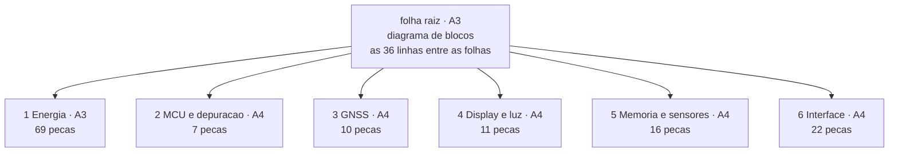
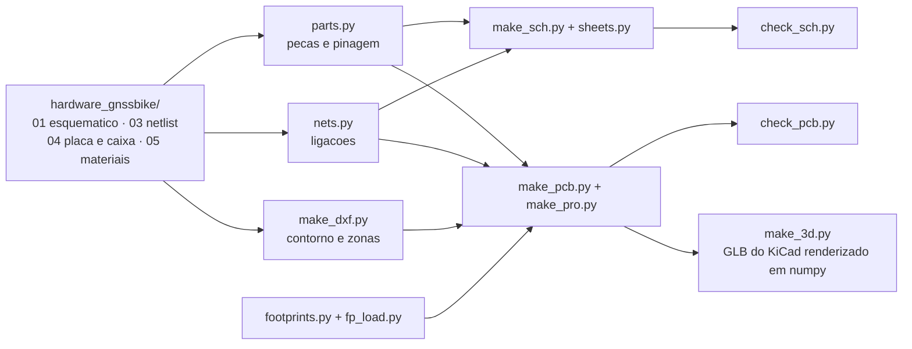

# Projeto KiCad da placa

Este diretório é o projeto de CAD do GNSS Bike Computer: **esquemático
hierárquico em sete folhas** e **placa com as 116 peças posicionadas e
roteadas**, em KiCad 8, gerados a partir dos documentos de
[`hardware_gnssbike/`](../README.md) e conferidos contra eles por programa.

> [!WARNING]
> **Nada aqui foi fabricado, montado ou medido.** Não existe placa, não existe
> protótipo e nenhum número desta página saiu de bancada. O roteamento é
> automático e **não está completo**: as ligações de RF ficam de fora de
> propósito e parte das ligações continua sem trilha.

## O que abrir

| Arquivo | O que é |
|---|---|
| `gnssbike.kicad_pro` | o projeto; **abra este** no KiCad |
| `gnssbike.kicad_sch` | folha raiz: o diagrama de blocos |
| `folha1-energia.kicad_sch` … `folha6-interface.kicad_sch` | as seis folhas |
| `gnssbike.kicad_pcb` | a placa |
| `gnssbike.kicad_dru` | as duas regras locais de folga |
| `gnssbike-esquematico.pdf` | as 7 páginas do esquemático |
| `gnssbike-pcb.pdf` | a placa em 2D, **uma página por camada de cobre** e uma quinta com as quatro juntas |
| `gnssbike-2d.svg` | as quatro camadas numa folha só, para olhar rápido |
| `gnssbike-3d-frente.png`, `-tras.png`, `-angulo.png` | a placa em 3D |
| `gnssbike-3d-montagem.png` | a pilha aberta: display em cima, placa, célula embaixo |

## O esquemático



### O tamanho da folha é medido, não escolhido

**Cinco das sete folhas são A4 e as outras duas A3.** Antes eram A0, A2 e
cinco A3, e a causa era a mesma do contorno da placa: o desenho era espalhado
para encher o papel em vez de o papel ser escolhido para caber o desenho.

| O que fazia | O que faz agora |
|---|---|
| Orçava **54 × 48 mm por peça**, fosse um 0402 ou um módulo de 80 pads | **desenha** na folha candidata e pergunta se a última linha terminou acima da margem — é o mesmo código que desenha, então a resposta não pode divergir do desenho |
| Nunca considerava A4: a busca começava em A3 | começa em **A4** |
| Corredores de 24 e 30 mm entre peças, mais largos que os próprios símbolos | **16 e 22 mm**, e quem prova que ainda cabe fio é o `check_sch.py`, que falha se um fio cruzar componente |
| Raiz em **A0 fixo**, blocos de 190 × 240 mm num passo de 370 × 350 | blocos dimensionados pelo que contêm (o do MCU tem 33 sinais atravessando), **A3** medido |

Um pino de folha ganhava um espaço de 5,08 mm para um rótulo de 1,27. A dois
passos de grade — o padrão do KiCad — o bloco do MCU caiu de 116 para 73 mm de
altura, e foi isso que tirou o diagrama de A2.

Três tipos de nó, cada um desenhado do jeito que se faz:

| Tipo | Como aparece | Quantos |
|---|---|---|
| **Trilho** (alimentação e terra) | símbolo de alimentação junto do pino que ele alimenta; o KiCad junta todos os de mesmo nome | 18 |
| **Entre folhas** | rótulo hierárquico na margem, pino no bloco da raiz, e a linha entre os blocos | 36 |
| **Dentro da folha** | só fio | 57 |

Dentro de cada folha as peças são colocadas na ordem em que se ligam, não por
tamanho: o capacitor de desacoplamento cai ao lado do CI que ele desacopla.

## A placa

| Item | Valor |
|---|---|
| Contorno | **34 × 90 mm**, canto de 3 mm, 0,8 mm de espessura — **derivado das regras**, não escrito à mão |
| Camadas | **4**: `F.Cu`, `In1.Cu` (terra), `In2.Cu` (alimentação), `B.Cu` |
| Por que esse tamanho | a 7.2 do ME54BS13 pede **50 mm entre dois módulos de rádio**, e esta placa tem dois. Varrendo cada milímetro que cumpre isso e ainda cabe a fila de teclas, 34 × 90 é o menor contorno com folga — **3.060 mm² contra os 5.335 do 55 × 97, 43 % menos** |
| Relação com a caixa | **nenhuma.** A placa sai do circuito; a caixa sai do display, da bateria e da mão. Encolher uma não encolhe a outra |
| Peças na placa | **116**, com rotação; 3 na face de trás |
| Fora da placa | 8 (o painel, a antena e os seis módulos solares moram na caixa e chegam por contato de mola) |
| Redes | **100** |
| Furo de fixação | **1**, M2, em (3,9; 48,5) |
| Planos de terra | **3**, em `In1.Cu` e nas duas faces, preenchidos |
| Roteamento | **127 ligações**, 680 segmentos, 266 vias; `RF_IN` e `RF_ANT` ficam de fora de propósito |
| Ligações sem trilha | **101** (o DRC do KiCad, com as malhas preenchidas) |

### O que decide a posição de cada peça

1. **A borda**, para quem tem de alcançá-la: o USB-C com a boca para fora, os
   dois cabos planos saindo pela esquerda, os contatos de mola nas laterais e
   o módulo de rádio deitado no canto de baixo à direita, com a antena sobre o
   recorte — que é o arranjo que a figura 1 da seção 7.5 da ficha dele chama
   de "Best". Nada disso é a caixa mandando no tamanho da placa: é o circuito
   dizendo de que lado cada coisa sai.
2. **A zona** de [`04-pcb-e-caixa.md`](../04-pcb-e-caixa.md), para quem tem
   uma. As zonas são **derivadas de `W` e `H`**, não retângulos fixos.
3. **A ligação**, para todo o resto: cada peça vai ao centro de gravidade das
   peças a que se liga.
4. **A rotação**: peça de dois terminais deita ao longo da linha entre as duas
   peças que ela junta, para a trilha sair reta.

### O que a regra dos 50 mm impôs ao arranjo

Com 34 mm de largura, três decisões deixaram de ser gosto:

| O que | Por quê |
|---|---|
| A fila de teclas **não** fica na borda de baixo | o módulo ocupa 17,0 mm dela e a fila pede 30,6; e os 5 mm que a 7.4 pede em volta da antena comem mais. A fila subiu para acima do módulo |
| O buzzer vai na **face de trás** | 10,5 × 9,5 mm não cabem na faixa de 9,25 mm que sobra na frente entre as teclas e o módulo. Empurrado, ele parava a 0,84 mm do TPS7A02 e tomava o anel que o desacoplamento dele precisa |
| O receptor GNSS fica a **180°** | a 0 o pino `RF_IN` saía do lado da borda, a 1,2 mm dela, e a rede π não tinha para onde ir — ficava a 10,5 mm de um pino que a 4.4 quer "as short as possible". Virado, o pino olha para dentro e a rede cabe em linha |

## Verificação

```sh
python hardware_gnssbike/cad/check_sch.py                 # regera e confere o esquematico
"D:/KiCAD/bin/kicad-cli.exe" sch export pdf --output hardware_gnssbike/cad/gnssbike-esquematico.pdf hardware_gnssbike/cad/gnssbike.kicad_sch
python hardware_gnssbike/cad/make_pcb.py                  # 1. coloca as pecas
python hardware_gnssbike/cad/route.py                     # 2. roteia o que consegue
"D:/KiCAD/bin/python.exe" hardware_gnssbike/cad/fill_zones.py   # 3. preenche as malhas de terra
python hardware_gnssbike/cad/check_pcb.py --como-esta      # 4. confere o arquivo como esta
python hardware_gnssbike/cad/dry_run_pcb.py               # 5. as regras das fichas
```

A ordem importa por dois motivos. Sem `--como-esta`, o passo 4 **regera a
placa** e apaga as trilhas. E **sem o passo 3 o DRC mente**: os geradores
escrevem a zona de terra como contorno e mais nada, que é arquivo legal — o
KiCad preenche ao abrir —, mas o `kicad-cli pcb drc` **não preenche**. Numa
placa sem preenchimento todo pad que só chega ao plano aparece como
desligado e toda via de costura como solta, e nenhuma folga é medida contra
o cobre despejado, que é justamente a mais importante numa placa coberta de
terra. O `fill_zones.py` chama o preenchedor do próprio KiCad, pelo `pcbnew`,
e por isso roda com o Python do KiCad. O que isso mudou nos números, medido:
**296 ligações sem trilha caíram para 100**, e apareceram **11 erros reais**
de haste térmica insuficiente que a placa vazia escondia.

Depois, as vistas:

```sh
python hardware_gnssbike/cad/make_dxf.py     # contorno e zonas em DXF
"D:/KiCAD/bin/kicad-cli.exe" pcb export glb --output hardware_gnssbike/cad/gnssbike.glb     --include-tracks --include-zones --subst-models hardware_gnssbike/cad/gnssbike.kicad_pcb
python hardware_gnssbike/cad/make_3d.py      # as quatro vistas 3D em PNG
"D:/KiCAD/bin/kicad-cli.exe" pcb export svg --output hardware_gnssbike/cad/gnssbike-2d.svg     --layers "F.Cu,In1.Cu,In2.Cu,B.Cu,F.SilkS,Edge.Cuts,F.Fab"     --page-size-mode 2 --exclude-drawing-sheet hardware_gnssbike/cad/gnssbike.kicad_pcb
python hardware_gnssbike/cad/make_2d.py      # o PDF, uma pagina por camada
```

O `make_2d.py` existe por causa do preenchimento. As quatro camadas numa
folha só eram legíveis enquanto as malhas estavam vazias; cheias, o despejo é
área sólida e **cobre as trilhas de baixo**, e a folha passa a mostrar o
contorno do cobre e quase nada mais. Quem lê uma placa lê **uma camada de
cada vez**, e é o que ele gera: quatro páginas com uma camada cada sobre o
contorno e a serigrafia, mais a quinta de conjunto.

### Por que o 3D não sai do KiCad sozinho

O `kicad-cli pcb export glb` só lê modelos **STEP**. Os corpos desenhados
aqui são VRML, então eles não entram no GLB — e o `make_3d.py` desenha esses
por conta própria, lendo o `.wrl` de cada um: a forma e a **cor** que o
arquivo traz, não uma caixa. A diferença não é estética. Enquanto ele
desenhava um paralelepípedo preto de contorno de footprint para os 23 corpos
próprios, o módulo de rádio, o receptor GNSS, as três teclas, o buzzer e o
receptáculo USB-C eram **tijolos pretos iguais** numa vista que existe
justamente para conferir se a peça é a que se pensa.

**Esquemático** — os 7 arquivos abrem; o **próprio KiCad** percorre a
hierarquia e exporta o netlist; os **100 nós elétricos saem iguais** aos da
lista de nós, pino a pino; nenhum nó a mais; os 37 pinos sem ligação são
exatamente os que a lista deixa soltos; **nenhum fio passa por cima de
componente** em folha nenhuma; nada fora da folha; nenhuma peça sobre outra;
e todo rótulo hierárquico tem o pino de folha que responde por ele.

**Placa** — o KiCad abre e roda o **DRC, que fecha em zero erro**, com as
malhas preenchidas e 101 ligações ainda sem trilha; as **116 peças** estão lá,
uma vez cada; **todo pad leva a rede da lista de nós** e nenhuma ligação ficou
sem pad; nenhum contorno sobre outro; nada passa da borda; nada dentro das
áreas de antena; a placa cabe na caixa; os três planos de terra existem.

**Regras das fichas** ([09](../09-dry-run-da-pcb.md)) — **17 cumpridas, 0
violadas, 5 que só bancada ou fabricante decidem**. As duas que falhavam na
placa de 55 × 97 caíram sozinhas quando a placa passou a ser dimensionada
pelo circuito:

| Regra | Na placa de 55 × 97 | Na de 34 × 90 |
|---|---|---|
| `RF9`, os 25 mm do display | falhava: a sombra do display chegava a **11,3 mm** do módulo | **passa**: o display é mais largo que a placa e não fica mais sobre ela; o pior agora é o cabo plano `J402`, a 31,3 mm |
| `AL1`, desacoplamento | falhava: `C114` a 3,3 mm do `U104` contra 2 | **passa**: o buzzer saiu de cima do regulador e o anel dele ficou livre |

### As duas regras locais de folga

`gnssbike.kicad_dru` abre exceção em dois footprints, e só neles:

| Regra | Por quê |
|---|---|
| `J101`, furo a cobre ≥ **0,175 mm** | os furos da blindagem do receptáculo USB-C ficam a **0,1801 mm** dos próprios pads |
| `U104`, folga ≥ **0,115 mm** | o pad térmico do TPS7A02 em X2SON de 1 × 1 mm fica a **0,1196 mm** dos próprios pinos |

Os dois são land patterns de fabricante, não desenho nosso. O resto da placa
segue **0,127 mm** de folga e **0,2 mm** de furo a cobre, que é o que uma
fábrica de quatro camadas faz sem custo extra. **Nenhuma fábrica foi
consultada** — e a pilha de camadas, a largura de 50 Ω e a de 90 Ω
diferencial esperam a mesma resposta.

## Serigrafia e pontos de teste

**Os dezesseis pontos de teste de [06](../06-conectores-e-pontos-de-teste.md)
estão na placa**, menos dois que o próprio documento não pode ter: o `TP111`
mede `ST_STO`, que a ficha do AEM10900 não tem, e o `TP401` mede `5V0`, de um
regulador que não é montado com o painel JDI. A lista mora em `parts.TESTE` e
o `nets.py` **recusa** um ponto que aponte para um nó inexistente.

**As referências estão em serigrafia nas duas faces**, cada peça na sua, no
mínimo que a fábrica imprime — **0,8 mm de altura com traço de 0,15** — e
**nenhuma cai sobre outra**. Não é automático: com todas no mesmo deslocamento
de 1,8 mm acima da peça, **37 pares ficavam sobrepostos**. O `rotulos()` de
[`make_pcb.py`](make_pcb.py) procura, para cada rótulo, o lugar livre mais
perto do contorno da própria peça, com duas regras em ordem — nunca sobre
outro rótulo, de preferência fora do contorno de outra peça.

| Medida | Antes | Agora |
|---|---|---|
| Altura do texto | 0,7 mm, traço 0,1 | **0,8 mm, traço 0,15** (mínimo de fábrica) |
| Pares sobrepostos | **37** | **0**, medidos no export do KiCad |
| Referências visíveis | 128, uma delas `REF**` | **127** (o `REF**` do furo foi escondido) |

### Por que a conferência é feita no export, e não aqui

O `make_pcb.py` tem um modelo de quanto espaço um rótulo ocupa, e ele estava
**30 % estreito**: 0,75 do tamanho do texto por caractere, contra os **1,06**
que o `textLength` do próprio KiCad mede. Com isso ele reportava **zero**
sobreposições enquanto a serigrafia exportada tinha **35 pares** um sobre o
outro. Havia um segundo erro por trás: o deslocamento era escolhido no
referencial da **placa**, e o KiCad gira uma propriedade de footprint pelo
ângulo do próprio footprint — um rótulo posto "acima" de uma peça girada 90°
saía ao lado dela.

Por isso o `check_pcb.py` **exporta as duas camadas de serigrafia em SVG** e
conta as sobreposições nos retângulos que o KiCad escreve, com o `textLength`
e o tamanho de fonte de cada texto. Modelo interno não confere modelo interno.

## Três footprints eram de outra peça

A conferência `ME3` compara o **corpo que a ficha de cada peça cota** com o
contorno do footprint desenhado para ela. Ao ganhar as cotas dos conectores,
ela pegou três casos em que o land pattern na placa é de uma peça **diferente
da que está na lista de compras** — e um land pattern errado não é detalhe:
a peça não solda.

| Peça da lista | Footprint que estava em uso | O que a ficha diz | Diferença |
|---|---|---|---|
| **Same Sky CPT-1117-83-SMT** (buzzer) | `Buzzer_CUI_CPT-9019S-SMT`, **redondo de 9 mm** | corpo **retangular de 11,0 × 9,0 × 1,7**, preso por duas abas de 2,0 × 0,2 mm, uma em cada ponta e em lados opostos, com furo de 0,8; padrão de solda de **duas ilhas de 2,5 × 2,5 a 10,5 mm** | **corrigido**: footprint desenhado aqui |
| **Molex 2036150003** (USB-C IPX8) | `USB_C_Receptacle_Palconn_UTC16-G` | corpo **9,99 × 8,58 × 4,21** | o footprint desenha **8,94 × 7,32**: falta **1,05 × 1,26 mm**. **Em aberto** |
| **Hirose FH28-10S-0.5SH(05)** (FPC do display) | `Hirose_FH12-10S-0.5SH`, outra série | corpo **9,90 × 5,70 × 2,55** | o footprint desenha **8,10** de largura: falta **1,80 mm**. **Em aberto** |

> [!CAUTION]
> **Os dois em aberto não foram consertados de propósito.** Reconstruir um
> land pattern de USB-C ou de conector FPC a partir de um desenho
> **renderizado** é exatamente o tipo de palpite que essa conferência existe
> para pegar, e errar o padrão de solda de um USB-C mata a placa. Nem a
> Molex 2036150003 nem a Hirose FH28 existem na biblioteca do KiCad 8. O que
> resolve é o arquivo de land pattern do fabricante, ou ler o desenho com
> confiança maior do que uma imagem dá. Enquanto isso, o `ME3` **falha**, e é
> para falhar.

A altura do USB-C também estava errada e foi corrigida: **4,21 mm** acima da
superfície de montagem, não os 3,26 que estavam escritos como "conferir".

## Footprints

| Origem | Quantos | O que significa |
|---|---|---|
| **EXATO** | 10 | o footprint da KiCad é desta peça |
| **ENCAPSULAMENTO** | 92 | mesmo encapsulamento, desenhado para outra peça. Cabe, e **ainda tem de ser conferido contra a ficha** |
| **GERADO** | 10 | não existe na KiCad; gerado aqui a partir das dimensões, com o land pattern **aproximado** |

O **módulo de rádio** é o `MinewSemi ME54BS13` (nRF54LM20A), 16,5 × 12,0 ×
2,4 mm, **80 pads**: 20 castelados nas laterais e uma matriz LGA de 60 no
miolo, 64 GPIO. O footprint foi gerado das cotas do desenho mecânico da ficha
V1.0.0, porque **a Minew não publica land pattern** — a ficha diz para pedir o
dela.

> [!CAUTION]
> **Os dois desenhos da Minew discordam do espelhamento.** O da ficha V1.0.0
> põe os pinos 1–10 (RF, SWD, USB) na lateral **esquerda**; o da V0.5.0 e o da
> página do produto põem na **direita**. Este projeto seguiu a V1.0.0, que é a
> mais nova e a única com números de pino. **Confira num módulo real antes de
> fabricar**: pelo desenho adotado, os três GND da primeira linha da matriz
> (D0, E0, F0) ficam do **mesmo lado do VCC (pino 19)**. Se estiverem do lado
> do SWD, o footprint está espelhado.

Oito peças **não estão na placa** porque moram na caixa: o painel `DS401`, a
antena `E301` e os seis módulos solares `PV101` a `PV106`. Os pads que os
recebem **passaram a existir**: `J302` para a antena e `J103` a `J105` para os
três grupos de módulos solares, dois pads de 2,0 × 2,0 mm a 3,0 mm de passo,
sem pasta de solda. **A mola em si ainda não foi escolhida** — a altura de
1,5 mm que o 3D desenha está declarada em `footprints.ALTURA` como não lida de
ficha nenhuma, e `parts.py` manda conferir antes de fabricar.

## De onde vem cada coisa



Nenhum arquivo do KiCad é editado à mão: tudo sai dos geradores, e os
geradores leem os documentos. Editar no KiCad e regerar apaga a edição — o
lugar de mudar é o gerador.

## O que falta

- [ ] **Terminar o roteamento.** 127 ligações têm trilha e **101 não**; as duas
      de RF (`RF_IN`, `RF_ANT`) ficam de fora de propósito, porque impedância
      e caminho delas não são negociáveis e o roteador automático não sabe
      disso.
- [ ] **Os 25 mm entre o módulo de rádio e o display** (`RF9`): decidir entre
      blindagem, camada ou aceitar e medir na bancada.
- [ ] **O desenho cotado do Hirose FH28.** O PDF que está aqui é só a folha de
      especificação: sem vista, sem corte, sem cotas. Sem ele os 3,4 × 10 mm
      da área do FPC em [04](../04-pcb-e-caixa.md) continuam sem origem.
- [ ] Conferir cada footprint **ENCAPSULAMENTO** contra a ficha da peça; onze
      já estão conferidos, com a cota do desenho mecânico em
      `footprints.PACOTE` e a conferência automática em `ME3`.
- [ ] Desenhar os footprints exatos do Molex 2036150003 (USB-C IPX8), do
      Hirose FH28-10S-0.5SH(05) e do Molex 503480-0500, e pedir à Minew o land
      pattern oficial do ME54BS13.
- [ ] Escolher a **mola** dos contatos do painel solar e da antena. Os pads
      existem (`J103` a `J105`, `J302`); a peça não.
- [ ] A pilha de camadas do fabricante, e com ela as larguras de 50 Ω e 90 Ω.
- [ ] As pendências que os documentos já carregam: a ordem das cinco vias da
      luz, o lado do sensor do MAX17262, a orientação do divisor do
      `DIS_STO_CH`, o `I2C_ADDR` e o `ST_STO` do AEM10900 (que **não existem**
      na ficha) e a tecla central ligada em dois lugares.
