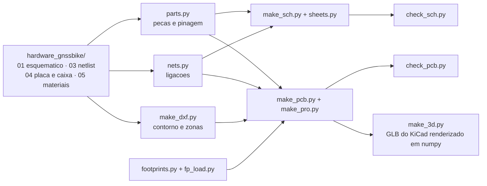

# Projeto KiCad da placa

Este diretório é o projeto de CAD do GNSS Bike Computer: **esquemático
hierárquico em sete folhas** e **placa com as 112 peças posicionadas**, em
KiCad 8, gerados a partir dos documentos de
[`hardware_gnssbike/`](../README.md) e conferidos contra eles por programa.

> [!WARNING]
> **Nada aqui foi fabricado, montado ou medido.** Não existe placa. Nenhuma
> trilha foi roteada: a placa traz o contorno, a pilha de camadas, as áreas
> proibidas, os dois planos de terra, o furo e **todas as peças posicionadas e
> giradas**. O roteamento é o passo seguinte.

## O que abrir

| Arquivo | O que é |
|---|---|
| `gnssbike.kicad_pro` | o projeto; **abra este** no KiCad |
| `gnssbike.kicad_sch` | folha raiz: o diagrama de blocos |
| `folha1-energia.kicad_sch` … `folha6-interface.kicad_sch` | as seis folhas |
| `gnssbike.kicad_pcb` | a placa |
| `gnssbike.kicad_dru` | as duas regras locais de folga |
| `gnssbike-esquematico.pdf` | as 7 páginas do esquemático |
| `gnssbike-pcb.pdf` | a placa em 2D, frente e verso |
| `gnssbike-3d-frente.png`, `-tras.png`, `-angulo.png` | a placa em 3D |

## O esquemático


Três tipos de nó, cada um desenhado do jeito que se faz:

| Tipo | Como aparece | Quantos |
|---|---|---|
| **Trilho** (alimentação e terra) | símbolo de alimentação junto do pino que ele alimenta; o KiCad junta todos os de mesmo nome | 18 |
| **Entre folhas** | rótulo hierárquico na margem, pino no bloco da raiz, e a linha entre os blocos | 36 |
| **Dentro da folha** | só fio | 57 |

Dentro de cada folha as peças são colocadas na ordem em que se ligam, não por
tamanho: o capacitor de desacoplamento cai ao lado do CI que ele desacopla.

## A placa

| Item | Valor |
|---|---|
| Contorno | **55 × 97 mm**, canto de 3 mm, 0,8 mm de espessura |
| Camadas | **4**: `F.Cu`, `In1.Cu` (terra), `In2.Cu` (alimentação), `B.Cu` |
| Cabe na caixa | sim: a caixa tem cerca de 58 × 100 mm por dentro, sobra **1,5 mm de cada lado** |
| Peças na placa | **112**, com rotação; 3 na face de trás |
| Fora da placa | 8 (painel, antena e os seis módulos solares moram na caixa) |
| Redes | **100** |
| Furo de fixação | **1**, M2, em (3,9; 48,5) |
| Planos de terra | 2, em `In1.Cu` e `B.Cu` |
| Roteamento | **nenhum** |

### O que decide a posição de cada peça

1. **A caixa**, para quem sai por ela: o USB-C com a boca para fora na borda
   de baixo, o cabo do display saindo pela esquerda, o módulo de rádio
   deitado com a antena olhando para fora da borda direita, as três teclas em
   fila, o sensor de luz sob a janela, o LED RGB sob o guia de luz.
2. **A zona** de [`04-pcb-e-caixa.md`](../04-pcb-e-caixa.md), para quem tem uma.
3. **A ligação**, para todo o resto: cada peça vai ao centro de gravidade das
   peças a que se liga.
4. **A rotação**: peça de dois terminais deita ao longo da linha entre as duas
   peças que ela junta, para a trilha sair reta.

### Três lugares onde a placa real diverge do documento

O documento escreveu a tabela de zonas antes de existir footprint. Três
retângulos dele não cabem a peça real, e a placa segue a peça:

| Onde | O documento | A peça |
|---|---|---|
| **USB-C** | zona de 9 × 3 mm | o receptáculo tem cerca de **9 × 10 mm**: o corpo entra na placa, não fica na borda. As teclas subiram para y 80,5 |
| **Módulo de rádio** | 10 × 16,2 mm, do Fanstel | o MinewSemi **ME54BS13 é 12 × 16,5 mm** e a ficha pede **4 mm livres** em volta do lado de RF, virado para fora. Ele deita com a antena na borda direita |
| **GNSS** | zona começa em y 2 | a área livre da antena vai até y 8. O documento já contava essa sobreposição como 90 mm² e a deixava em aberto; aqui o receptor fica **abaixo**, em y 8,5 |

## Verificação

```sh
python hardware_gnssbike/cad/check_sch.py     # regera e confere o esquematico
python hardware_gnssbike/cad/check_pcb.py     # regera e confere a placa
python hardware_gnssbike/cad/make_3d.py       # as vistas 3D
```

**Esquemático** — os 7 arquivos abrem; o **próprio KiCad** percorre a
hierarquia e exporta o netlist; os **100 nós elétricos saem iguais** aos da
lista de nós, pino a pino; nenhum nó a mais; os 37 pinos sem ligação são
exatamente os que a lista deixa soltos; **nenhum fio passa por cima de
componente** em folha nenhuma; nada fora da folha; nenhuma peça sobre outra;
e todo rótulo hierárquico tem o pino de folha que responde por ele.

**Placa** — o KiCad abre e roda o **DRC, que fecha em zero erro** (as 307
ligações sem trilha são esperadas: nada foi roteado); as 112 peças estão lá,
uma vez cada; **todo pad leva a rede da lista de nós** e nenhuma ligação ficou
sem pad; nenhum contorno sobre outro; nada passa da borda; nada dentro das
áreas de antena; a placa cabe na caixa; os dois planos de terra existem.

### As duas regras locais de folga

`gnssbike.kicad_dru` abre exceção em dois footprints, e só neles:

| Regra | Por quê |
|---|---|
| `J101`, furo a cobre ≥ **0,175 mm** | os furos da blindagem do receptáculo USB-C ficam a **0,1801 mm** dos próprios pads |
| `U104`, folga ≥ **0,115 mm** | o pad térmico do TPS7A02 em X2SON de 1 × 1 mm fica a **0,1196 mm** dos próprios pinos |

Os dois são land patterns de fabricante, não desenho nosso. O resto da placa
segue **0,127 mm** de folga e **0,2 mm** de furo a cobre, que é o que uma
fábrica de quatro camadas faz sem custo extra. **Nenhuma fábrica foi
consultada** — e a pilha de camadas, a largura de 50 Ω e a de 90 Ω
diferencial esperam a mesma resposta.

## Footprints

| Origem | Quantos | O que significa |
|---|---|---|
| **EXATO** | 10 | o footprint da KiCad é desta peça |
| **ENCAPSULAMENTO** | 92 | mesmo encapsulamento, desenhado para outra peça. Cabe, e **ainda tem de ser conferido contra a ficha** |
| **GERADO** | 10 | não existe na KiCad; gerado aqui a partir das dimensões, com o land pattern **aproximado** |

O **módulo de rádio** é o `MinewSemi ME54BS13` (nRF54LM20A), 16,5 × 12,0 ×
2,4 mm, **80 pads**: 20 castelados nas laterais e uma matriz LGA de 60 no
miolo, 64 GPIO. O footprint foi gerado das cotas do desenho mecânico da ficha
V1.0.0, porque **a Minew não publica land pattern** — a ficha diz para pedir o
dela.

> [!CAUTION]
> **Os dois desenhos da Minew discordam do espelhamento.** O da ficha V1.0.0
> põe os pinos 1–10 (RF, SWD, USB) na lateral **esquerda**; o da V0.5.0 e o da
> página do produto põem na **direita**. Este projeto seguiu a V1.0.0, que é a
> mais nova e a única com números de pino. **Confira num módulo real antes de
> fabricar**: pelo desenho adotado, os três GND da primeira linha da matriz
> (D0, E0, F0) ficam do **mesmo lado do VCC (pino 19)**. Se estiverem do lado
> do SWD, o footprint está espelhado.

Oito peças **não estão na placa** porque moram na caixa e chegam por contato
de mola ou cabo plano que documento nenhum dimensiona: o painel `DS401`, a
antena `E301` e os seis módulos solares `PV101` a `PV106`. **Os pads que os
recebem não existem em lugar nenhum** — é uma lacuna, não uma decisão.

## De onde vem cada coisa



Nenhum arquivo do KiCad é editado à mão: tudo sai dos geradores, e os
geradores leem os documentos. Editar no KiCad e regerar apaga a edição — o
lugar de mudar é o gerador.

## O que falta

- [ ] **Rotear.** Nada foi roteado.
- [ ] Conferir cada footprint **ENCAPSULAMENTO** contra a ficha da peça.
- [ ] Desenhar os footprints exatos do Molex 2036150003 (USB-C IPX8), do
      Hirose FH28-10S-0.5SH(05) e do Molex 503480-0500, e pedir à Minew o land
      pattern oficial do ME54BS13.
- [ ] Os pads de contato do painel solar, da antena e do painel.
- [ ] A pilha de camadas do fabricante, e com ela as larguras de 50 Ω e 90 Ω.
- [ ] As pendências que os documentos já carregam: a ordem das cinco vias da
      luz, o lado do sensor do MAX17262, a orientação do divisor do
      `DIS_STO_CH`, o `I2C_ADDR` e o `ST_STO` do AEM10900 (que **não existem**
      na ficha) e a tecla central ligada em dois lugares.
