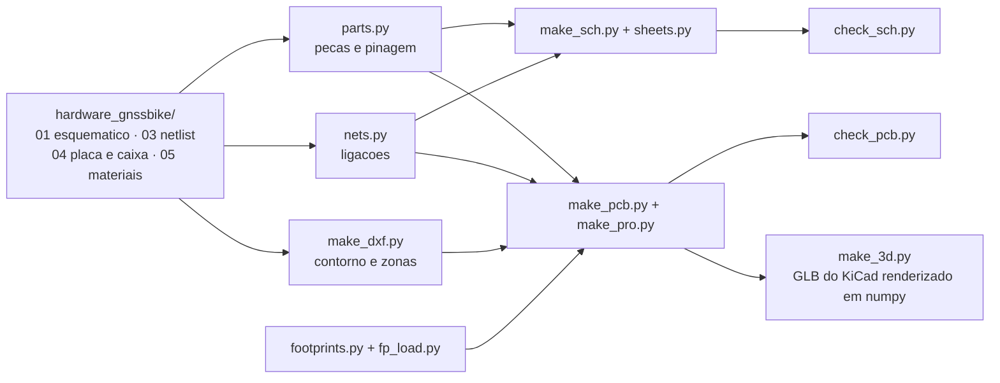

# Projeto KiCad da placa

Este diretório é o projeto de CAD do GNSS Bike Computer: **esquemático
hierárquico em sete folhas** e **placa com as 116 peças posicionadas e
roteadas**, em KiCad 8, gerados a partir dos documentos de
[`hardware_gnssbike/`](../README.md) e conferidos contra eles por programa.

> [!WARNING]
> **Nada aqui foi fabricado, montado ou medido.** Não existe placa, não existe
> protótipo e nenhum número desta página saiu de bancada. O roteamento é
> automático e **não está completo**: as ligações de RF ficam de fora de
> propósito e parte das ligações continua sem trilha.

## O que abrir

| Arquivo | O que é |
|---|---|
| `gnssbike.kicad_pro` | o projeto; **abra este** no KiCad |
| `gnssbike.kicad_sch` | folha raiz: o diagrama de blocos |
| `folha1-energia.kicad_sch` … `folha6-interface.kicad_sch` | as seis folhas |
| `gnssbike.kicad_pcb` | a placa |
| `gnssbike.kicad_dru` | as duas regras locais de folga |
| `gnssbike-esquematico.pdf` | as 7 páginas do esquemático |
| `gnssbike-pcb.pdf` | a placa em 2D, **uma página por camada de cobre** e uma quinta com as quatro juntas |
| `gnssbike-2d.svg` | as quatro camadas numa folha só, para olhar rápido |
| `gnssbike-3d-frente.png`, `-tras.png`, `-angulo.png` | a placa em 3D |
| `gnssbike-3d-montagem.png` | a pilha aberta: display em cima, placa, célula embaixo |

## O esquemático


Três tipos de nó, cada um desenhado do jeito que se faz:

| Tipo | Como aparece | Quantos |
|---|---|---|
| **Trilho** (alimentação e terra) | símbolo de alimentação junto do pino que ele alimenta; o KiCad junta todos os de mesmo nome | 18 |
| **Entre folhas** | rótulo hierárquico na margem, pino no bloco da raiz, e a linha entre os blocos | 36 |
| **Dentro da folha** | só fio | 57 |

Dentro de cada folha as peças são colocadas na ordem em que se ligam, não por
tamanho: o capacitor de desacoplamento cai ao lado do CI que ele desacopla.

## A placa

| Item | Valor |
|---|---|
| Contorno | **55 × 97 mm**, canto de 3 mm, 0,8 mm de espessura |
| Camadas | **4**: `F.Cu`, `In1.Cu` (terra), `In2.Cu` (alimentação), `B.Cu` |
| Cabe na caixa | sim: a caixa tem cerca de 58 × 100 mm por dentro, sobra **1,5 mm de cada lado** |
| Peças na placa | **116**, com rotação; 3 na face de trás |
| Fora da placa | 8 (o painel, a antena e os seis módulos solares moram na caixa e chegam por contato de mola) |
| Redes | **100** |
| Furo de fixação | **1**, M2, em (3,9; 48,5) |
| Planos de terra | **3**, em `In1.Cu` e nas duas faces, preenchidos |
| Roteamento | **127 ligações**, 680 segmentos, 266 vias; `RF_IN` e `RF_ANT` ficam de fora de propósito |
| Ligações sem trilha | **101** (o DRC do KiCad, com as malhas preenchidas) |

### O que decide a posição de cada peça

1. **A caixa**, para quem sai por ela: o USB-C com a boca para fora na borda
   de baixo, o cabo do display saindo pela esquerda, o módulo de rádio
   deitado com a antena olhando para fora da borda direita, as três teclas em
   fila, o sensor de luz sob a janela, o LED RGB sob o guia de luz.
2. **A zona** de [`04-pcb-e-caixa.md`](../04-pcb-e-caixa.md), para quem tem uma.
3. **A ligação**, para todo o resto: cada peça vai ao centro de gravidade das
   peças a que se liga.
4. **A rotação**: peça de dois terminais deita ao longo da linha entre as duas
   peças que ela junta, para a trilha sair reta.

### Três lugares onde a placa real diverge do documento

O documento escreveu a tabela de zonas antes de existir footprint. Três
retângulos dele não cabem a peça real, e a placa segue a peça:

| Onde | O documento | A peça |
|---|---|---|
| **USB-C** | zona de 9 × 3 mm | o receptáculo tem cerca de **9 × 10 mm**: o corpo entra na placa, não fica na borda. As teclas subiram para y 80,5 |
| **Módulo de rádio** | 10 × 16,2 mm, do Fanstel | o MinewSemi **ME54BS13 é 12 × 16,5 mm** e a ficha pede **4 mm livres** em volta do lado de RF, virado para fora. Ele deita com a antena na borda direita |
| **GNSS** | zona começa em y 2 | a área livre da antena vai até y 8. O documento já contava essa sobreposição como 90 mm² e a deixava em aberto; aqui o receptor fica **abaixo**, em y 8,5 |

## Verificação

```sh
python hardware_gnssbike/cad/check_sch.py                 # regera e confere o esquematico
python hardware_gnssbike/cad/make_pcb.py                  # 1. coloca as pecas
python hardware_gnssbike/cad/route.py                     # 2. roteia o que consegue
"D:/KiCAD/bin/python.exe" hardware_gnssbike/cad/fill_zones.py   # 3. preenche as malhas de terra
python hardware_gnssbike/cad/check_pcb.py --como-esta      # 4. confere o arquivo como esta
python hardware_gnssbike/cad/dry_run_pcb.py               # 5. as regras das fichas
```

A ordem importa por dois motivos. Sem `--como-esta`, o passo 4 **regera a
placa** e apaga as trilhas. E **sem o passo 3 o DRC mente**: os geradores
escrevem a zona de terra como contorno e mais nada, que é arquivo legal — o
KiCad preenche ao abrir —, mas o `kicad-cli pcb drc` **não preenche**. Numa
placa sem preenchimento todo pad que só chega ao plano aparece como
desligado e toda via de costura como solta, e nenhuma folga é medida contra
o cobre despejado, que é justamente a mais importante numa placa coberta de
terra. O `fill_zones.py` chama o preenchedor do próprio KiCad, pelo `pcbnew`,
e por isso roda com o Python do KiCad. O que isso mudou nos números, medido:
**296 ligações sem trilha caíram para 100**, e apareceram **11 erros reais**
de haste térmica insuficiente que a placa vazia escondia.

Depois, as vistas:

```sh
python hardware_gnssbike/cad/make_dxf.py     # contorno e zonas em DXF
"D:/KiCAD/bin/kicad-cli.exe" pcb export glb --output hardware_gnssbike/cad/gnssbike.glb     --include-tracks --include-zones --subst-models hardware_gnssbike/cad/gnssbike.kicad_pcb
python hardware_gnssbike/cad/make_3d.py      # as quatro vistas 3D em PNG
"D:/KiCAD/bin/kicad-cli.exe" pcb export svg --output hardware_gnssbike/cad/gnssbike-2d.svg     --layers "F.Cu,In1.Cu,In2.Cu,B.Cu,F.SilkS,Edge.Cuts,F.Fab"     --page-size-mode 2 --exclude-drawing-sheet hardware_gnssbike/cad/gnssbike.kicad_pcb
python hardware_gnssbike/cad/make_2d.py      # o PDF, uma pagina por camada
```

O `make_2d.py` existe por causa do preenchimento. As quatro camadas numa
folha só eram legíveis enquanto as malhas estavam vazias; cheias, o despejo é
área sólida e **cobre as trilhas de baixo**, e a folha passa a mostrar o
contorno do cobre e quase nada mais. Quem lê uma placa lê **uma camada de
cada vez**, e é o que ele gera: quatro páginas com uma camada cada sobre o
contorno e a serigrafia, mais a quinta de conjunto.

### Por que o 3D não sai do KiCad sozinho

O `kicad-cli pcb export glb` só lê modelos **STEP**. Os corpos desenhados
aqui são VRML, então eles não entram no GLB — e o `make_3d.py` desenha esses
por conta própria, lendo o `.wrl` de cada um: a forma e a **cor** que o
arquivo traz, não uma caixa. A diferença não é estética. Enquanto ele
desenhava um paralelepípedo preto de contorno de footprint para os 23 corpos
próprios, o módulo de rádio, o receptor GNSS, as três teclas, o buzzer e o
receptáculo USB-C eram **tijolos pretos iguais** numa vista que existe
justamente para conferir se a peça é a que se pensa.

**Esquemático** — os 7 arquivos abrem; o **próprio KiCad** percorre a
hierarquia e exporta o netlist; os **100 nós elétricos saem iguais** aos da
lista de nós, pino a pino; nenhum nó a mais; os 37 pinos sem ligação são
exatamente os que a lista deixa soltos; **nenhum fio passa por cima de
componente** em folha nenhuma; nada fora da folha; nenhuma peça sobre outra;
e todo rótulo hierárquico tem o pino de folha que responde por ele.

**Placa** — o KiCad abre e roda o **DRC, que fecha em zero erro**, com as
malhas preenchidas e 101 ligações ainda sem trilha; as **116 peças** estão lá,
uma vez cada; **todo pad leva a rede da lista de nós** e nenhuma ligação ficou
sem pad; nenhum contorno sobre outro; nada passa da borda; nada dentro das
áreas de antena; a placa cabe na caixa; os três planos de terra existem.

**Regras das fichas** ([09](../09-dry-run-da-pcb.md)) — **15 cumpridas, 2
violadas, 5 que só bancada ou fabricante decidem**. As duas violadas estão
escritas porque são escolhas, não descuido:

| Regra | O que dá | O que a ficha pede | Por quê |
|---|---|---|---|
| `RF9` | display a **11,3 mm** do módulo de rádio | 25 mm | não cabe: display de 40,08 × 61,8 numa placa de 55 × 97. A saída da própria ficha é blindagem ou camada |
| `AL1` | `C114` a **3,3 mm** do `U104` | 2 mm | preço de repor os 20 mm entre o módulo e o que chaveia, que é regra de RF e ganha |

### As duas regras locais de folga

`gnssbike.kicad_dru` abre exceção em dois footprints, e só neles:

| Regra | Por quê |
|---|---|
| `J101`, furo a cobre ≥ **0,175 mm** | os furos da blindagem do receptáculo USB-C ficam a **0,1801 mm** dos próprios pads |
| `U104`, folga ≥ **0,115 mm** | o pad térmico do TPS7A02 em X2SON de 1 × 1 mm fica a **0,1196 mm** dos próprios pinos |

Os dois são land patterns de fabricante, não desenho nosso. O resto da placa
segue **0,127 mm** de folga e **0,2 mm** de furo a cobre, que é o que uma
fábrica de quatro camadas faz sem custo extra. **Nenhuma fábrica foi
consultada** — e a pilha de camadas, a largura de 50 Ω e a de 90 Ω
diferencial esperam a mesma resposta.

## Footprints

| Origem | Quantos | O que significa |
|---|---|---|
| **EXATO** | 10 | o footprint da KiCad é desta peça |
| **ENCAPSULAMENTO** | 92 | mesmo encapsulamento, desenhado para outra peça. Cabe, e **ainda tem de ser conferido contra a ficha** |
| **GERADO** | 10 | não existe na KiCad; gerado aqui a partir das dimensões, com o land pattern **aproximado** |

O **módulo de rádio** é o `MinewSemi ME54BS13` (nRF54LM20A), 16,5 × 12,0 ×
2,4 mm, **80 pads**: 20 castelados nas laterais e uma matriz LGA de 60 no
miolo, 64 GPIO. O footprint foi gerado das cotas do desenho mecânico da ficha
V1.0.0, porque **a Minew não publica land pattern** — a ficha diz para pedir o
dela.

> [!CAUTION]
> **Os dois desenhos da Minew discordam do espelhamento.** O da ficha V1.0.0
> põe os pinos 1–10 (RF, SWD, USB) na lateral **esquerda**; o da V0.5.0 e o da
> página do produto põem na **direita**. Este projeto seguiu a V1.0.0, que é a
> mais nova e a única com números de pino. **Confira num módulo real antes de
> fabricar**: pelo desenho adotado, os três GND da primeira linha da matriz
> (D0, E0, F0) ficam do **mesmo lado do VCC (pino 19)**. Se estiverem do lado
> do SWD, o footprint está espelhado.

Oito peças **não estão na placa** porque moram na caixa: o painel `DS401`, a
antena `E301` e os seis módulos solares `PV101` a `PV106`. Os pads que os
recebem **passaram a existir**: `J302` para a antena e `J103` a `J105` para os
três grupos de módulos solares, dois pads de 2,0 × 2,0 mm a 3,0 mm de passo,
sem pasta de solda. **A mola em si ainda não foi escolhida** — a altura de
1,5 mm que o 3D desenha está declarada em `footprints.ALTURA` como não lida de
ficha nenhuma, e `parts.py` manda conferir antes de fabricar.

## De onde vem cada coisa



Nenhum arquivo do KiCad é editado à mão: tudo sai dos geradores, e os
geradores leem os documentos. Editar no KiCad e regerar apaga a edição — o
lugar de mudar é o gerador.

## O que falta

- [ ] **Terminar o roteamento.** 127 ligações têm trilha e **101 não**; as duas
      de RF (`RF_IN`, `RF_ANT`) ficam de fora de propósito, porque impedância
      e caminho delas não são negociáveis e o roteador automático não sabe
      disso.
- [ ] **Os 25 mm entre o módulo de rádio e o display** (`RF9`): decidir entre
      blindagem, camada ou aceitar e medir na bancada.
- [ ] **O desenho cotado do Hirose FH28.** O PDF que está aqui é só a folha de
      especificação: sem vista, sem corte, sem cotas. Sem ele os 3,4 × 10 mm
      da área do FPC em [04](../04-pcb-e-caixa.md) continuam sem origem.
- [ ] Conferir cada footprint **ENCAPSULAMENTO** contra a ficha da peça; onze
      já estão conferidos, com a cota do desenho mecânico em
      `footprints.PACOTE` e a conferência automática em `ME3`.
- [ ] Desenhar os footprints exatos do Molex 2036150003 (USB-C IPX8), do
      Hirose FH28-10S-0.5SH(05) e do Molex 503480-0500, e pedir à Minew o land
      pattern oficial do ME54BS13.
- [ ] Escolher a **mola** dos contatos do painel solar e da antena. Os pads
      existem (`J103` a `J105`, `J302`); a peça não.
- [ ] A pilha de camadas do fabricante, e com ela as larguras de 50 Ω e 90 Ω.
- [ ] As pendências que os documentos já carregam: a ordem das cinco vias da
      luz, o lado do sensor do MAX17262, a orientação do divisor do
      `DIS_STO_CH`, o `I2C_ADDR` e o `ST_STO` do AEM10900 (que **não existem**
      na ficha) e a tecla central ligada em dois lugares.
