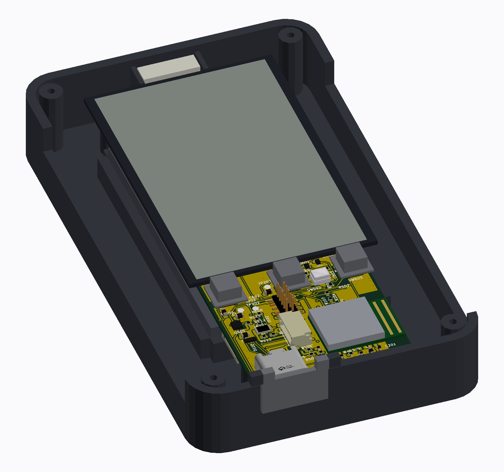

# A caixa

A proposta de caixa em volta da placa real, desenhada por programa e medida
por um dry run próprio. **Nada foi impresso.** As decisões, o que cada regra
mede e o que ficou para o dono estão em
[04 · Placa e caixa](../04-pcb-e-caixa.md#a-placa-de-hoje-dentro-da-caixa-do-conceito);
o que ela mudou na placa, em
[10 · Dry-run de 2026-09-26](../10-dry-run-2026-09-26.md#adendo-da-tarde-a-caixa-medida-e-o-que-ela-mudou-na-placa).



| Arquivo | O que é |
|---|---|
| [`make_caixa.py`](make_caixa.py) | desenha a caixa em volta de `cad/gnssbike.kicad_pcb` (o courtyard, a altura e a face de cada peça, e o GLB da placa): o PDF, as três vistas 3D e os STL |
| [`dry_run_caixa.py`](dry_run_caixa.py) | mede a mesma `Caixa` com 13 regras: folga sob a tampa e sobre a célula, o teto do display, capas sobre as chaves, janela e vidro, entalhe e porta do USB-C, bossas e pilares, bossas da tampa contra as antenas, janelas do LED e do sensor, furos do buzzer e do barômetro, bolsos, coberturas e fendas de fio dos módulos, o chanfro assentando na parede e a folga da face interna dele, o berço da antena externa; uma regra que não acha o que medir **falha** |
| [`gnssbike-caixa.pdf`](gnssbike-caixa.pdf) | três páginas: frente com a tampa e a porta, por dentro com o berço, cortes A-A e B-B, a tecla e o bolso de um módulo, as premissas, o que não bate e as peças |
| `caixa-concha.stl`, `caixa-tampa.stl` | a concha e a tampa (PETG ou ASA, 0,2 mm; a tampa de cabeça para baixo, com suporte sob os chanfros) |
| `caixa-tecla-1.stl`, `-2`, `-3` | as três capas das teclas, cada uma com a sua aba |
| `caixa-membrana-teclas.stl` | a membrana de TPU de 0,3 mm sobre as teclas |
| `caixa-cobertura-faceta.stl`, `caixa-cobertura-chanfro.stl` | as coberturas transparentes dos módulos solares (a do chanfro, quatro vezes) |
| `caixa-porta-usb.stl` | a porta do USB-C (o pino de ø1,5 à parte) |

Os STL são sopas de triângulos de caixas sobrepostas, que o fatiador une: servem
para a primeira prova impressa, não para usinar. As vistas 3D ficam em
[`docs/img/hardware/`](../../docs/img/hardware/) (`gnssbike-3d-caixa-aberta.png`,
`-frente.png`, `-explodida.png`).

## Como rodar

Depois da cadeia da placa ([`cad/README.md`](../cad/README.md#verificação)),
porque os dois leem a placa colocada e o `make_caixa.py` precisa do GLB que o
`dry_run_pcb.py` exporta:

```sh
python hardware_gnssbike/caixa/dry_run_caixa.py   # 13 regras; código 1 se alguma falhar
python hardware_gnssbike/caixa/make_caixa.py      # PDF e STL aqui, vistas em docs/img/hardware/
```

Resultado de 2026-09-26: **12 regras medidas e cumpridas, 0 violadas, 1 não
medida** (a passagem dos fios dos módulos, as juntas, o aperto das capas e os
parafusos auto-atarraxantes só uma prova impressa mede).

## O que a caixa é

| Item | Valor |
|---|---|
| Caixa | 62 × 106 × 17 mm, raio 7, paredes 2, fundo e tampa 1,5 |
| Placa | 34 × 95, centrada, a 0,5 mm da parede de baixo; duas bossas M2 e quatro pilares |
| Pilha | célula colada no fundo entre nervuras; 1,2 mm de peças do verso; placa em z 10,5 a 11,3; 3,0 mm sob o display; display colado sob a tampa em volta da janela |
| Teclas | três capas de 5 em furos de 5,6, exatamente sobre as chaves da placa (passo 13,4), sob membrana de TPU |
| Painéis | dois módulos de 23 × 8 na faceta abaixo das teclas e dois em cada chanfro de 45° e 7,5 mm, sob coberturas transparentes, com furos e fendas de fio |
| USB-C | entalhe na parede de baixo e na aba da tampa, com porta articulada por fora |
| Antena GNSS externa | berço com duas nervuras e lábio contra a parede de cima, para uma patch de 12 × 12 × 4 em pé (opção) |
| Tampa | quatro parafusos M2 nos cantos |
