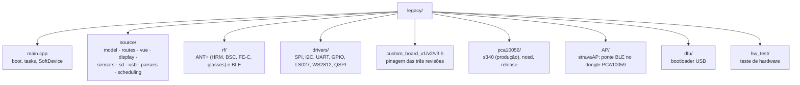

# legacy · stravaV10 original

Esta pasta guarda o firmware que inspira o projeto: o **stravaV10**, computador de bordo GPS para ciclismo de código aberto escrito por **Vincent Gollé** (`vincent290587` no GitHub; `v.golle`, `vgol` e `vincent` nos cabeçalhos), entre 2015 e 2020. É **só referência**: o firmware ativo é o port em [`../zephyr_app/`](../zephyr_app/).

| Item | Valor |
|---|---|
| Origem | [github.com/vincent290587/stravaV10](https://github.com/vincent290587/stravaV10), ramo `develop` |
| Placa | myStravaB V3 ([`../hardware/`](../hardware/)); o README do upstream aponta o projeto Eagle em `vincent290587/EAGLE`, `Projects/myStravaB_V3` |
| Licença | **Creative Commons Atribuição-NãoComercial 4.0 Internacional (CC BY-NC 4.0)**, conforme o `LICENSE.md` do upstream (que não veio nesta cópia) |
| Cópia local | arquivos com data de 2025-11-25 |

> [!IMPORTANT]
> A CC BY-NC 4.0 exige atribuição e proíbe uso comercial. O port em `zephyr_app/` traduz algoritmos, constantes e estruturas deste código, então é uma obra derivada: a licença do projeto precisa levar isso em conta. As bibliotecas de terceiros em [`../libraries/`](../libraries/) têm licenças próprias (ver `docs/12-ferramentas-testes.md`).

## Regras

- **Não altere o código daqui.** Esta pasta é a especificação de comportamento do port; mudar o legacy apaga a referência. Este README é o único arquivo do projeto dentro dela.
- **Não compile para produção.** O build exige nRF5 SDK 16.0.0, SoftDevice S340 6.1.1 e GCC 6 2017-q2-update, que não estão instalados nesta máquina.
- Ao portar, cite a origem como `legacy/<arquivo>:<linha>` no commit e na documentação, e registre toda diferença de constante ou fórmula em `docs/06-algoritmos.md` e `docs/10-status-do-port.md`.

## O que tem aqui



| Pasta ou arquivo | Conteúdo |
|---|---|
| `main.cpp`, `app_config.h`, `helper.*` | inicialização, criação das tasks do task manager cooperativo, SoftDevice S340 |
| `source/Model.*`, `source/g_structs.*`, `source/parameters.h` | objetos globais, estruturas compartilhadas e constantes do algoritmo |
| `source/model/` | `Boucle*` (laço por modo), `Attitude` (fusão e potência), `Locator` (fontes de posição), zonas, `UserSettings` |
| `source/routes/` | `Vecteur`, `Points`, `ListePoints`, `Segment` (segmentos Strava), `Parcours` (GPX) |
| `source/vue/`, `source/display/` | telas (`VueCRS`, `VueFEC`, `VuePRC`, `VueGPS`, `VueDebug`), menus, notificações, zoom |
| `source/sensors/` | `GPSMGMT` (GPS MediaTek), FXOS, BME280, MS5637, STC3100, VEML6075, FRAM |
| `source/sd/`, `source/usb/`, `source/parsers/` | FatFs sobre SD/NOR, USB CDC e MSC, leitura dos arquivos de rota |
| `source/scheduling/` | agendador do I2C e gerenciamento de energia |
| `rf/` | ANT+ (`ant.c`, `hrm.c`, `bsc.c`, `fec.c`, `glasses.c`, `ant_device_manager.cpp`) e BLE (`ble_api6.c`) |
| `*_wrapper*.h` | abstrações que trocam a implementação ARM pela de host do simulador (`../tools/TDD`) |

## Diferenças em relação ao upstream

| Upstream | Nesta cópia |
|---|---|
| raiz do repositório | esta pasta `legacy/` |
| `libraries/` | [`../libraries/`](../libraries/), na raiz do projeto |
| `TDD/`, `TDDW/`, `zpm/`, `MMD/`, `jumper/` | [`../tools/`](../tools/) |
| `docs/` (imagens do README) | [`../docs/img/`](../docs/img/) |
| submódulos `libraries/ble_services` e `libraries/ant_profiles` (`vincent290587/ble_services`, `vincent290587/ant_profiles`) | pastas vazias: os submódulos não foram baixados |
| `LICENSE.md`, `README.md`, `CMakeLists.txt`, `CodeCoverage.cmake`, `.circleci/`, `ozone.jdebug`, `.editorconfig`, `.gitmodules` | ausentes |

## Build original (referência)

```sh
cd pca10056/s340/armgcc
make                    # compila
make flash_softdevice   # grava o S340 pelo J-Link (ou: make dfu_softdevice)
make flash              # grava a aplicação pelo J-Link (ou: make dfu)
```

- O DFU por USB exige o bootloader de `dfu/` já gravado. Para entrar em DFU, segure o botão direito ao conectar o cabo USB.
- `dfu/Readme.md` cita o SDK 15.3.0 para o bootloader; `AP/README.md` cita o SDK 16.0.0 para o stravaAP.

## Onde ler mais

- Arquitetura do firmware original e glossário dos nomes em francês: [`../docs/04-arquitetura-legacy.md`](../docs/04-arquitetura-legacy.md).
- O que já foi portado e o que falta: [`../docs/10-status-do-port.md`](../docs/10-status-do-port.md).
